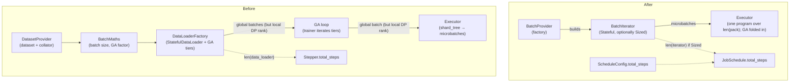

# DEP-0009: Data Flow - `JobSchedule` & `BatchProvider`

## Abstract

The current data path conflates two unrelated concerns: how long a job runs and what one step feeds the model. This proposal splits them into two owners. **`JobSchedule`** replaces `Stepper` and resolves the job's duration. **`BatchProvider`** replaces `DatasetProvider`, `DataLoaderFactory`, and `BatchMaths` as the data entry point — a factory that builds a **`BatchIterator`**: a `Stateful`, optionally `Sized` iterator yielding **packs**, a pack being exactly one step's worth of microbatches ready for the engine. Gradient accumulation stops being a loop in the trainer and becomes just a pipeline program over the pack; the executor no longer shards inputs but consumes the microbatches the iterator produced, recompiling its program every step so pack length — and hence batch size — may vary. This breaks the data and pipelining public APIs and therefore requires this DEP.

## Motivation

### Duration must not be a property of the dataset

The current loop is *data-driven*. `Stepper.total_steps` is consumed only by the progress bar, the `should_do_action(last_step)` cadence, and the "already trained fully" early-return; the loop itself terminates when `for batch_group in self._state.data_loader` runs dry. The flaw is that **duration is a job decision the dataset should not own**. Two cases expose this:

- **The duration you want differs from the data you have.** A fixed step budget — "train for exactly 1000 steps", for a debug run over a huge corpus, or to compare runs across datasets of different sizes — is set independently of how many samples exist. The data length, computable or not, is simply the wrong number to drive it; today the only knob is `len(data_loader)`, so there is no way to say it.
- **Some sources have no length to read.** An online-RL stream produces rollouts indefinitely; "how long to train" is purely a budget, and there is no finite length even in principle. Faking a `__len__` to satisfy `Stepper` is a lie that also has to be expressed in *samples*, not steps — re-deriving `BatchMaths`' arithmetic by hand, silently wrong when `microbatch_size`/DP/accumulation change.

### Batch production has no single owner

A microbatch's journey today crosses three components that must silently agree:

1. `BatchMaths` computes `data_loader_batch_size = microbatch_size × num_microbatches_pipelining` and the gradient-accumulation factor.
2. `DataLoaderFactory` builds a `StatefulDataLoader` of that batch size and groups consecutive batches into gradient-accumulation tiers via `IteratorBatchGroup`.
3. The pipeline executor takes the assembled global batch and **re-splits** it into microbatches with `shard_tree` and a `ShardingSpec`.

This produces three concrete problems:

1. **A pointless batch→shard round-trip.** The loader assembles a global batch only for the pipeline executor to disassemble it again.
2. **The batch dimension is load-bearing.** `global_batch_size` / `microbatch_size` assume a "batch" is a fixed count of samples sliced along dim 0. Strategies where one model row is built from several source samples (token packing, dynamic budgets) do not fit.
3. **The data path is untraceable.** "Get samples → produce PP inputs" is smeared across three files, so no one place describes what a step feeds the model.

## Design Proposal

The design has two independent owners — `JobSchedule` for *duration*, the `BatchProvider` / `BatchIterator` pair for *data* — plus the executor and trainer changes that follow from packs replacing global batches.

The data path before and after, and where the two lengths go:



### `JobSchedule`

`JobSchedule` keeps everything `Stepper` did — `current_step` and `total_steps` tracking, the `step()` increment, `Stateful` save/load of progress, and the `should_do_action(...)` periodic-cadence helpers — but changes **where `total_steps` comes from**. It is resolved once at construction from two inputs: an optional explicit config value, and the `BatchIterator` (consulted only if it is `Sized`).

Resolution rules:

| config | iterator is Sized   | outcome                       |
|--------|---------------------|-------------------------------|
| set    | no                  | use config                    |
| set    | yes, `len ≥ config` | use config                    |
| set    | yes, `len < config` | raise                         |
| unset  | yes                 | use `len` (like current impl) |
| unset  | no                  | raise                         |

`Stepper` is deleted and every consumer migrates.

### `BatchProvider` and `BatchIterator`

There are two roles, deliberately separated. **`BatchProvider`** is the factory the user supplies to the train/eval loop — exactly like `OptimizerProvider` or `LRSchedulerProvider` — a callable that, given the run context, builds the data pipeline. **`BatchIterator`** is what it returns: the stateful iterator the loop actually drives.

```python

Pack = list[PyTree]  # one step: a list of microbatches, each an opaque tensor-like PyTree


@typing.runtime_checkable
class BatchProvider(Protocol):
    def __call__(self, context: InitializeBatchIteratorContext) -> "BatchIterator": ...


@typing.runtime_checkable
class BatchIterator(Iterator[Pack], Stateful, Protocol):
    def __iter__(self) -> "BatchIterator": ...
    def __next__(self) -> Pack: ...
    # optionally also Sized: __len__() -> int  (number of *steps*)
```

`InitializeBatchIteratorContext` carries the run context the factory needs (the `DistributedContext` and the data-loading config), replacing today's `InitializeDatasetContext`.

The `BatchIterator`'s responsibilities:

- **It yields packs.** A pack is one step. `len(pack)` is the number of microbatches *within* that step — there is no separate microbatch count to declare anywhere. This length may differ step to step.
- **It is `Stateful`.** The iterator is the single checkpoint boundary for the data stream; it saves and restores its own position so resumption is exact.
- **It is optionally `Sized`.** If it can report the number of *steps* it will yield, `JobSchedule` may derive `total_steps` from it. If it cannot (streaming or data-dependent dynamic batching), `total_steps` must come from `ScheduleConfig`.

Two distinct lengths, previously conflated, are now explicit: `len(pack)` feeds the execution program; `len(iterator)` (if present) feeds `JobSchedule`.

A `BatchIterator` yields CPU (optionally memory-pinned) tensors; moving each pack to the device is the loop's job.

Data-parallel sharding does **not** move. Today the user already shards inside their `DatasetProvider` (wrapping with `ShardedDataset` / `shard_dataset_data_parallel`, which read the `dp` dimension of the batch-domain mesh). That responsibility stays in the data layer, now inside the `BatchProvider`.

#### Composition-first default iterators

We ship the common setups as a stack of small `BatchIterator` pieces. A `BatchProvider` composes them; the default training stack is two layers:

```python
# 1. Source: dataset shard + collator + stateful loader → a stream of single microbatches.
source = MicrobatchSource(
    dataset=shard_dataset_data_parallel(my_dataset, dist_context),
    collator=my_collator,
    microbatch_size=microbatch_size,
    loading=data_loading_config,
)

# 2. Packer: groups microbatches into one pack (= one step). This is the BatchIterator.
iterator = FixedCountPacker(source, microbatches_per_step=accumulation_factor)
```

- `MicrobatchSource` wraps a `StatefulDataLoader` whose `batch_size` is the microbatch size and yields one collated microbatch at a time. It is `Sized` when the dataset is.
- **Packers** turn the microbatch stream into packs. For instance, `FixedCountPacker (microbatches_per_step=k)` yields packs of exactly `k` microbatches, reproducing today's gradient-accumulation behavior exactly. It is `Sized`.

The arithmetic that `BatchMaths` performed — `global_batch_size / (dp_size × microbatch_size)` to derive the accumulation factor — survives as a small free helper used to configure `FixedCountPacker`; it is no longer a stateful component threaded through the loop.

### Changes to the execution engine

#### Gradient accumulation is a pipeline program

Once the iterator emits a pack of microbatches, the trainer no longer loops over gradient-accumulation tiers. There is exactly one execution unit per step — the pack — and the schedule consumes all of its microbatches. The non-PP single-GPU path and the PP path become the same shape: "run the program for `len(pack)` microbatches." Concretely:

- **`PipelineScheduleExecutor`** (distributed) already iterates a per-microbatch program; it simply receives the microbatches directly instead of producing them by sharding.
- **`OfflinePipelineExecutor`** (single-GPU) today hardcodes `microbatch=0` and runs one forward/backward. It now loops forward/backward over the pack's microbatches, driving the same per-microbatch callback contract the distributed executor uses.

#### Per-step reconfiguration

Because pack length varies, some things that are fixed at construction today become per-step. The fan-out lives **inline in the task operator**, which is the single existing seam between the data path and the executor — no new coordinator object:

```python
def forward_backward(self, pack: Pack) -> ForwardResult | None:
    n = len(pack)
    self._pipeline.schedule.configure(pack)
    self._pipeline_state.set_num_shards(n)
    self._grad_manager.set_required_accumulations(n)
    try:
        self._pipeline.schedule.step(pack)
        ...
    finally:
        self._pipeline_state.reset()
```

#### Killing input-sharding in the pipeline API

With the iterator emitting ready microbatches, the executor never splits inputs. All the API related to sharding is removed from the pipelining API.

Task's `build_forward_inputs` survives but changes granularity: it maps **one microbatch** of raw data into model-stage inputs, and returns only `inputs` / `kwargs` (no sharding spec). The task operator calls it per microbatch in the pack.

#### `ModuleSupportsPipelining` resignature

Stage buffer allocation infers shapes from the inputs. Today `infer_stage_inputs_from_pipeline_inputs(inputs, n_microbatches)` is handed the **global** batch and divides by `n_microbatches`. Under packs there is no global batch; the stage is handed a **representative microbatch** (`pack[0]`) and `n_microbatches=len(pack)`. The protocol methods are re-documented (and the parameter renamed from `inputs` to `microbatch_inputs`) to reflect that they now receive a single microbatch, not a global batch to be divided.

## Usage

A `BatchProvider` is the user's factory: given the run context, it composes and returns a `BatchIterator`. It is passed to the train/eval loop alongside the other providers.

```python
class ProjectBatchProvider(BatchProvider):
    def __call__(self, ctx: InitializeBatchIteratorContext) -> BatchIterator:
        dataset = shard_dataset_data_parallel(load_my_dataset(), ctx.dist_context)
        source = MicrobatchSource(dataset, collator=collate, microbatch_size=4, loading=ctx.data_loading)
        return FixedCountPacker(
            source,
            microbatches_per_step=fixed_count_for_global_batch(ctx, global_batch_size=256, microbatch_size=4),
        )
```

## Backward Compatibility

This is a **breaking** change. Breaking surfaces for the user API:

- **`Stepper` → `JobSchedule`.** Logic is the same, but there are changes in names.
- **`DatasetProvider` → `BatchProvider`.** The factory now returns a `BatchIterator` instead of a dataset + collator; user code migrates from "return dataset + collator" to "compose a `BatchIterator` from the shipped pieces" (the default stack reproduces current behavior verbatim).
- **`PipelineSchedule` API changes** (`configure`/`step(pack)`); `PipelineShardingSpec` and `BuildForwardInputsResult.pipeline_sharding_spec` are removed.
- **`ModuleSupportsPipelining`** inference methods receive a representative microbatch.

## Alternatives Considered

### Leave the pipeline's input-sharding untouched

The conservative option: keep the executor as the sharder, add `JobSchedule`/`BatchProvider` around it, have the iterator yield one global batch per step — no pipelining API change. Rejected on a capability limit: `shard_tree` cuts a tensor into `n` equal dim-0 slices, so it cannot express *any* motivating case — pack length can't vary (slices must divide evenly), microbatches can't differ in shape (same tensor), and a row can't be assembled from several samples (it's a contiguous cut). The splitter is the wrong primitive; keeping it makes the headline features impossible, not merely "less done", and preserves the batch→shard round-trip. Keeping it *alongside* packs is worse still — the engine would carry two input contracts forever for no gain.

### A single configurable default `BatchIterator` class

One class with flags for fixed/streaming/token-budget packing, instead of the Source ▶ Packer stack. Rejected: a god class. The stack lets users swap one layer and add their own packers against a tiny interface.

### A dedicated `StepCoordinator` for per-step reconfiguration

The per-step fan-out could live in its own object rather than inline in the task operator. Rejected as needless indirection: three ordered calls at the seam that already owns the data→executor handoff, with no state to justify a class.
