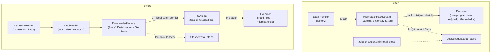

# DEP-0009: Data Flow - `JobSchedule` & `DataProvider`

## Abstract

The current data path conflates two unrelated concerns: how long a job runs and what one step feeds the model. This proposal splits them into two owners. **`JobSchedule`** replaces `Stepper` and resolves the job's duration. **`DataProvider`** replaces `DatasetProvider`, `DataLoaderFactory`, and `BatchMaths` as the data entry point — a factory that builds a **`MicrobatchPackStream`**: a `Stateful`, optionally `Sized` iterable yielding **microbatch packs**, a pack being exactly one step's worth of microbatches ready for the engine. Gradient accumulation stops being a loop in the trainer and becomes just a pipeline program over the pack; the executor no longer shards inputs but consumes the microbatches the stream produced, recompiling its program (and reallocating buffers) whenever pack length or microbatch shapes change — so pack length, and hence batch size, may vary step to step. This breaks the data and pipelining public APIs and therefore requires this DEP.

## Motivation

### Duration must not be a property of the dataset

The current loop is *data-driven*. `Stepper.total_steps` is consumed only by the progress bar, the `should_do_action(last_step)` cadence, and the "already trained fully" early-return; the loop itself terminates when `for batch_group in self._state.data_loader` runs dry. The flaw is that **duration is a job decision the dataset should not own**. Two cases expose this:

- **The duration you want differs from the data you have.** A fixed step budget — "train for exactly 1000 steps", for a debug run over a huge corpus, or to compare runs across datasets of different sizes — is set independently of how many samples exist. The data length, computable or not, is simply the wrong number to drive it; today the only knob is `len(data_loader)`, so there is no way to say it.
- **Some sources have no length to read.** An online-RL stream produces rollouts indefinitely; "how long to train" is purely a budget, and there is no finite length even in principle. Faking a `__len__` to satisfy `Stepper` is a lie that also has to be expressed in *samples*, not steps — re-deriving `BatchMaths`' arithmetic by hand, silently wrong when `microbatch_size`/DP/accumulation change.

### Batch production has no single owner

A microbatch's journey today crosses three components that must silently agree:

1. `BatchMaths` computes `data_loader_batch_size = microbatch_size × num_microbatches_pipelining` and the gradient-accumulation factor.
2. `DataLoaderFactory` builds a `StatefulDataLoader` of that batch size and groups consecutive batches into gradient-accumulation tiers via `IteratorBatchGroup`.
3. The pipeline executor takes the assembled global batch and **re-splits** it into microbatches with `shard_tree` and a `ShardingSpec`.

This produces three concrete problems:

1. **A pointless batch→shard round-trip.** The loader assembles a global batch only for the pipeline executor to disassemble it again.
2. **The batch dimension is load-bearing.** `global_batch_size` / `microbatch_size` assume a "batch" is a fixed count of samples sliced along dim 0. Strategies where one model row is built from several source samples (token packing, dynamic budgets) do not fit.
3. **The data path is untraceable.** "Get samples → produce PP inputs" is smeared across three files, so no one place describes what a step feeds the model.

## Design Proposal

The design has two independent owners — `JobSchedule` for *duration*, the `DataProvider` / `MicrobatchPackStream` pair for *data* — plus the executor and trainer changes that follow from packs replacing global batches.

The data path before and after, and where the two lengths go:


```mermaid
flowchart LR
    subgraph before["Before"]
        direction LR
        bDS["DatasetProvider<br/>(dataset + collator)"] --> bBM["BatchMaths<br/>(batch size, GA factor)"]
        bBM --> bDL["DataLoaderFactory<br/>(StatefulDataLoader + GA tiers)"]
        bDL -->|"DP-local batch per tier"| bGA["GA loop<br/>(trainer iterates tiers)"]
        bGA -->|"one batch"| bEX["Executor<br/>(shard_tree → microbatches)"]
        bDL -.->|"len(data_loader)"| bST["Stepper.total_steps"]
    end

    subgraph after["After"]
        direction LR
        aBP["DataProvider<br/>(factory)"] -->|builds| aBI["MicrobatchPackStream<br/>(Stateful, optionally Sized)"]
        aBI -->|"pack = list[microbatch]"| aEX["Executor<br/>(one program over len(pack); GA folded in)"]
        aBI -.->|"len(stream) if Sized"| aJS["JobSchedule.total_steps"]
        aCFG["JobScheduleConfig.total_steps"] -.-> aJS
    end

    before ~~~ after
```

### `JobSchedule`

`JobSchedule` keeps everything `Stepper` did — `current_step` and `total_steps` tracking, the `step()` increment, `Stateful` save/load of progress, and the `should_do_action(...)` periodic-cadence helpers — but changes **where `total_steps` comes from**. It is resolved once at construction from two inputs: an optional explicit config value (`JobScheduleConfig.total_steps`), and the `MicrobatchPackStream` (consulted only if it is `Sized`). Only `current_step` is persisted in the `Stateful` state; `total_steps` is re-resolved on load, so the configured budget may change across resumes.

Resolution rules:

| config | stream is Sized     | outcome                       |
|--------|---------------------|-------------------------------|
| set    | no                  | use config                    |
| set    | yes, `len ≥ config` | use config                    |
| set    | yes, `len < config` | raise                         |
| unset  | yes                 | use `len` (like current impl) |
| unset  | no                  | raise                         |

`Stepper` is deleted and every consumer migrates.

### `DataProvider` and `MicrobatchPackStream`

There are two roles, deliberately separated. **`DataProvider`** is the factory the user supplies to the train/eval loop — exactly like `ModelProvider` or `OptimizerProvider` — a callable that, given the run context, builds the data pipeline. **`MicrobatchPackStream`** is what it returns: the stateful, iterable stream the loop actually drives.

Both protocols live in `d9d.core.protocol` alongside `OptimizerProtocol` / `LRSchedulerProtocol`. `MicrobatchPackStream` is deliberately an *iterable*, not a self-iterator (no `__next__`): consumers only ever do `for pack in stream`, so making it iterable lets a concrete stream implement `__iter__` as a generator and keep its iteration cursor in the generator frame instead of as mutable object state.

```python
MicrobatchPack = Sequence[PyTree]  # one step: microbatches, each an opaque tensor-like PyTree (in d9d.core.types)


@typing.runtime_checkable
class DataProvider(Protocol):
    def __call__(self, context: InitializeDataProviderContext) -> "MicrobatchPackStream": ...


@typing.runtime_checkable
class MicrobatchPackStream(Stateful, Protocol):
    def __iter__(self) -> Iterator[MicrobatchPack]: ...
    # optionally also Sized: __len__() -> int  (number of *steps*)
```

`InitializeDataProviderContext` carries the run context the factory needs (only the `DistributedContext`). Data-loading settings are *not* passed through the context: a `DataProvider` fully owns how it builds its pipeline, and a custom one may not use a torch `DataLoader` at all.

The `MicrobatchPackStream`'s responsibilities:

- **It yields packs.** A pack is one step. `len(pack)` is the number of microbatches *within* that step — there is no separate microbatch count to declare anywhere. This length may differ step to step.
- **It is `Stateful`.** The stream is the single checkpoint boundary for the data; it saves and restores its own position so resumption is exact.
- **It is optionally `Sized`.** If it can report the number of *steps* it will yield, `JobSchedule` may derive `total_steps` from it. If it cannot (streaming or data-dependent dynamic batching), `total_steps` must come from `JobScheduleConfig`.

Two distinct lengths, previously conflated, are now explicit: `len(pack)` feeds the execution program; `len(stream)` (if present) feeds `JobSchedule`.

A `MicrobatchPackStream` yields CPU (optionally memory-pinned) tensors; moving each pack to the device is the loop's job.

Data-parallel sharding does **not** move. Today the user already shards inside their `DatasetProvider` (wrapping with `ShardedDataset` / `shard_dataset_data_parallel`, which read the `dp` dimension of the batch-domain mesh). That responsibility stays in the data layer, now inside the `DataProvider`.

#### Composition-first default stack

We ship the common setup as a stack of small pieces (in `d9d.dataset.batch_iterator`). A `DataProvider` composes them; the default training stack is two layers:

```python
# 1. Loader: a stateful data loader over the sharded dataset whose batch_size is the microbatch size,
#    yielding one collated microbatch at a time. torchdata's StatefulDataLoader is used directly.
loader = StatefulDataLoader(
    shard_dataset_data_parallel(my_dataset, dist_context),
    batch_size=microbatch_size,
    collate_fn=my_collator,
)

# 2. Packer: groups microbatches into one pack (= one step). This is the MicrobatchPackStream.
stream = FixedCountMicrobatchPacker(loader, microbatches_per_step=accumulation_factor)
```

- The loader layer is any object satisfying `DataLoaderProtocol` — a `Stateful`, `Sized` iterable of single microbatches. A torchdata `StatefulDataLoader` (with `batch_size` set to the microbatch size, over a pre-sharded dataset) satisfies it out of the box, so no wrapper class is shipped; the protocol lives in `d9d.core.protocol`.
- **Packers** turn the microbatch stream into packs. `FixedCountMicrobatchPacker(microbatches_per_step=k)` yields packs of exactly `k` microbatches (with `drop_last` controlling whether a short trailing pack is dropped — training drops it, evaluation keeps it), reproducing today's gradient-accumulation behavior. It is `Sized`, and delegates its `Stateful` state to the loader.

The arithmetic that `BatchMaths` performed — `global_batch_size / (dp_size × microbatch_size)` to derive the accumulation factor — survives as a small free helper, `num_microbatches_for_global_batch`, used to configure the packer; it is no longer a stateful component threaded through the loop.

#### The `AutoDataProvider` convenience

Mirroring `AutoOptimizerProvider` / `AutoLRSchedulerProvider`, we ship an `AutoDataProvider` (in `d9d.loop.auto`) that wires the default stack for the common case. It takes a `dataset_factory` and a `collator` (the non-serializable pieces) plus an `AutoDataConfig` (the serializable knobs: `global_batch_size`, `microbatch_size`, `shard_indexing_mode`, `drop_last`, and the serializable `DataLoader` settings such as `shuffle` / `num_workers` / `pin_memory` / `prefetch_factor`). It shards, builds the loader, derives the accumulation factor, and returns a `FixedCountMicrobatchPacker`. Jobs needing non-serializable loader arguments (`worker_init_fn`, custom samplers, …) write their own `DataProvider`.

### Changes to the execution engine

#### Gradient accumulation is a pipeline program

Once the stream emits a pack of microbatches, the trainer no longer loops over gradient-accumulation tiers. There is exactly one execution unit per step — the pack — and the schedule consumes all of its microbatches. The non-PP single-GPU path and the PP path become the same shape: "run the program for `len(pack)` microbatches." Concretely:

- **`PipelineScheduleExecutor`** (distributed) already iterates a per-microbatch program; it simply receives the microbatches directly instead of producing them by sharding.
- **`OfflinePipelineExecutor`** (single-GPU) today hardcodes `microbatch=0` and runs one forward/backward. It now loops forward/backward over the pack's microbatches, driving the same per-microbatch callback contract the distributed executor uses.

#### Per-step reconfiguration

Because pack length varies, the two things fixed at construction today become per-step. The fan-out lives **inline in the task operator**, which is the single existing seam between the data path and the executor — no new coordinator object. The operator builds the per-microbatch inputs (calling `build_forward_inputs` once per microbatch), tells the gradient manager how many backward passes this step performs, and drives the schedule:

```python
def forward_backward(self, pack: MicrobatchPack) -> None:
    inputs_microbatches, kwargs_microbatches = self._build_microbatch_inputs(pack)  # one build per microbatch
    self._grad_manager.set_required_accumulations(len(pack))  # backward fires len(pack) times this step
    self._pipeline.schedule.step(inputs_microbatches, kwargs_microbatches)
```

`configure` and `step` are a single call: the schedule receives the already-built per-microbatch inputs and lazily (re)compiles its program and (re)allocates buffers inside `step`, guarded by caches keyed on the microbatch count and the representative microbatch's shapes/dtypes — so the common constant-shape run compiles and allocates exactly once. The operator returns nothing; loss/weight and metrics are accumulated per microbatch through the loss callback (see below).

#### Killing input-sharding in the pipeline API

With the stream emitting ready microbatches, the executor never splits inputs. All the API related to sharding is removed from the pipelining API.

Task's `build_forward_inputs` survives but changes granularity: it maps **one microbatch** of raw data into model-stage inputs, and returns `inputs` / `kwargs` (no sharding spec) plus the typed `state` side-data (see below). The task operator calls it per microbatch in the pack.

#### `PipelineState` loses its two views and becomes typed task state

`PipelineState` does two jobs today. It **carries side-data** from `build_forward_inputs` to `compute_loss` for the same microbatch — labels, masks, anything the model's forward does not return but the loss needs. And it **bridges two views** of that data: a **global** view (written once against the whole batch) and a **sharded** view (read per microbatch), via `shard_tree`/`unshard_tree`.

The carry-data job stays; the dual view goes. With per-microbatch execution, `build_forward_inputs(microbatch_i)` and `compute_loss` for microbatch `i` operate on the same unit, so there is no global batch to write and no sharding to undo — the `shard_tree`/`unshard_tree` machinery (the same even-dim-0 split this DEP removes from the executor, with the same inability to handle uneven or opaque microbatches) is deleted. Once the executor (input sharding) and the pipeline state (dual view) stop using it, nothing in the library or examples consumes `d9d.core.sharding` at all, so the whole package (`shard_tree`, `unshard_tree`, `ShardingSpec` and the spec helpers) is removed.

The side-data itself stops being a bespoke dict-like object. There is no `PipelineState` abstract interface, no mutable `ctx.state` written in place from an untyped wrapper. Instead the `Task` gains a second type parameter — `TState`, bound to `PyTree` — and `build_forward_inputs` **returns** it (`BuildForwardInputsResult.state: TState`) alongside `inputs`/`kwargs`. `ComputeLossContext` / `ProcessOutputsContext` / `UpdateMetricsContext` carry that same `TState`, so a task that declares `TState = MyLabels(TypedDict)` reads `ctx.state["labels"]` **fully typed**, not `Any`. Tasks that carry nothing use `None`. The `PipelineStateHandler` becomes a thin per-microbatch store: `store(i, state)` caches the build-time side-data (detached), and `scope(i)` yields it to the loss/output processing as a context manager that re-detaches every tensor leaf on exit — so a task may still stash a model output into the state during `compute_loss` for `update_metrics` to read, and the cached graph is never kept alive past the microbatch. The detach — the one behavior beyond a plain dict — lives entirely in that store.

Aggregation no longer flows through the state either: the per-microbatch callback hands the task each microbatch's outputs as produced, and the task accumulates directly into objects that already do so — loss/weight into the `GradientManager` (`add_loss_with_weight`, a running `WeightedMeanMetric`), metrics into their own `Stateful` accumulators — so no global tensor is ever materialized. The loss callback (`LossComputer`) is the model stages' callback, yet it now needs the `GradientManager`, which is itself built from those stages; this cycle is broken by a two-phase init — the callback is constructed with the task and schedule, then `bind(gradient_manager, metrics)` attaches the accumulation sinks once the stages exist.

#### `ModuleSupportsPipelining` resignature

Stage buffer allocation infers shapes from the inputs. Today `infer_stage_inputs_from_pipeline_inputs(inputs, n_microbatches)` is handed the **global** batch and divides by `n_microbatches`. Under packs there is no global batch; the stage is handed a **representative microbatch** (`pack[0]`). The `n_microbatches` parameter is dropped entirely (nothing consumed it once the division was gone), and the parameter is renamed from `inputs` to `microbatch_inputs` to reflect that it is a single microbatch, not a global batch to be divided.

The methods also stop returning `torch.Tensor` and instead return **`TensorSpec`** (a small frozen `shape` / `dtype` / `layout` descriptor living in `d9d.core.types`, re-exported from `d9d.pipelining.api` for module authors). The framework never read the tensor *data* — the stage communication handler only reads shape/dtype/layout to size its P2P buffers — so returning real tensors was a lie that only worked because the framework silently wrapped the call in `torch.device("meta")`. Returning specs makes the "no allocation" contract structural rather than positional, and lets the `meta`-device wrapper be removed from the stage.

## Usage

A `DataProvider` is the user's factory: given the run context, it composes and returns a `MicrobatchPackStream`. It is passed to the train/eval loop alongside the other providers.

```python
class ProjectDataProvider(DataProvider):
    def __call__(self, ctx: InitializeDataProviderContext) -> MicrobatchPackStream:
        dataset = shard_dataset_data_parallel(load_my_dataset(), ctx.dist_context)
        loader = StatefulDataLoader(dataset, collate_fn=collate, batch_size=4)
        return FixedCountMicrobatchPacker(
            loader,
            microbatches_per_step=num_microbatches_for_global_batch(ctx.dist_context, global_batch_size=256, microbatch_size=4),
        )
```

For the common case, the shipped `AutoDataProvider` collapses this to configuration:

```python
provider = AutoDataProvider(
    dataset_factory=lambda dist_context: load_my_dataset(),
    collator=collate,
    config=AutoDataConfig(global_batch_size=256, microbatch_size=4),
)
```

## Backward Compatibility

This is a **breaking** change. Breaking surfaces for the user API:

- **`Stepper` → `JobSchedule`.** Logic is the same, but there are changes in names, and the persisted state now holds only `current_step` (checkpoints from before this DEP will not restore the step counter).
- **`DatasetProvider` → `DataProvider`.** The factory now returns a `MicrobatchPackStream` instead of a dataset + collator; user code migrates from "return dataset + collator" to "compose a `MicrobatchPackStream` from the shipped pieces" (the default stack, or `AutoDataProvider`, reproduces current behavior verbatim).
- **`PipelineSchedule` API changes**: `configure_buffers` + `step` collapse into a single `step(inputs_microbatches, kwargs_microbatches)`; `PipelineShardingSpec` and `BuildForwardInputsResult.pipeline_sharding_spec` are removed.
- **`d9d.core.sharding` is removed** (`shard_tree`, `unshard_tree`, `ShardingSpec`, `shard_spec_*`), as nothing consumes it once input sharding leaves the pipeline.
- **`ModuleSupportsPipelining`** inference methods receive a representative microbatch (the `n_microbatches` parameter is removed) and return `dict[str, TensorSpec]` instead of `dict[str, torch.Tensor]`.
- **Task state is now typed and returned, not mutated.** `TrainTask`/`InferenceTask` gain a `TState` type parameter (`Task[TBatch, TState]`); `build_forward_inputs` returns `state` in its result instead of writing into a mutable `ctx.state`; the `PipelineState` interface is removed. `ComputeLossContext`/`ProcessOutputsContext`/`UpdateMetricsContext` expose the typed `state`.

## Alternatives Considered

### Leave the pipeline's input-sharding untouched

The conservative option: keep the executor as the sharder, add `JobSchedule`/`DataProvider` around it, have the stream yield one global batch per step — no pipelining API change. Rejected on a capability limit: `shard_tree` cuts a tensor into `n` equal dim-0 slices, so it cannot express *any* motivating case — pack length can't vary (slices must divide evenly), microbatches can't differ in shape (same tensor), and a row can't be assembled from several samples (it's a contiguous cut). The splitter is the wrong primitive; keeping it makes the headline features impossible, not merely "less done", and preserves the batch→shard round-trip. Keeping it *alongside* packs is worse still — the engine would carry two input contracts forever for no gain.

### A single configurable default `MicrobatchPackStream` class

One class with flags for fixed/streaming/token-budget packing, instead of the loader ▶ packer stack. Rejected: a god class. The stack lets users swap one layer and add their own packers against a tiny interface.

### A dedicated `StepCoordinator` for per-step reconfiguration

The per-step fan-out could live in its own object rather than inline in the task operator. Rejected as needless indirection: three ordered calls at the seam that already owns the data→executor handoff, with no state to justify a class.
