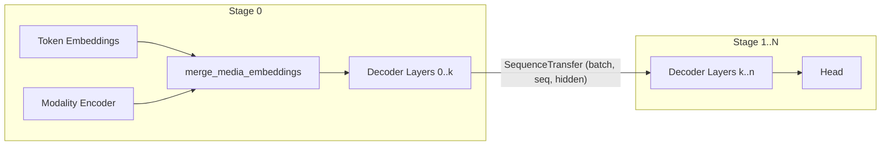

# DEP-0011: Multimodal Models

## Abstract

d9d's model catalogue is text-only: every model consumes `SequenceInput` (token ids) and nothing
else. Modern frontier models (Qwen3-VL, Qwen3.5, Qwen3-Omni) are multimodal — a language backbone
consumes a token sequence in which some positions are placeholders filled with embeddings produced
by one or more *modality encoders* (a vision tower for images and videos, an audio tower, etc.).

This DEP introduces multimodality as a first-class entity in d9d:

1. **Packed media IO types** — `MediaSegments` and the `ModalityEncoder` trait, plus the
   catalogue-level `MultimodalSequenceInput` pipeline input.
2. **The merge convention** — `merge_media_embeddings` replaces placeholder token embeddings on
   the first pipeline stage; nothing downstream of the first stage changes.
3. **The composition** — `MultimodalBackbone` wraps a text-only backbone with a modality encoder
   and is itself a `DecoderBackbone`, so the DEP-0007 task heads attach to a multimodal model
   exactly as they do to a text-only one.
4. **Vision building blocks** — patch embedding, packed bidirectional attention, 2D rotary
   embeddings, interpolated position embeddings, and a spatial patch merger under
   `d9d.module.block.vision`.
5. **Multimodal rotary embeddings (MRoPE)** — `MultimodalRotaryEmbeddingProvider` for 3D
   (temporal/height/width) position ids, plus dataset-side helpers to compute them.
6. **Varlen SDPA backends** — a variable-length counterpart to the DEP-0008 attention backend
   protocol, required for packed (non-rectangular) media attention.
7. **Data conventions** — collator contracts for packing media, placeholder masks, and the
   empty-media convention needed for collective-safety under FSDP.

The design is additive: existing text-only models and scripts keep working (see Backward
Compatibility). The first consumer will be the Qwen3.5 model family (dense and
MoE), implemented in a follow-up (non-DEP) PR on top of these APIs.

## Motivation

Adding a multimodal model to d9d today would require ad-hoc answers to at least six architectural
questions, each of which becomes a de-facto convention the moment the first model ships:

* **Where do media tensors enter the pipeline?** Media inputs are variable-length and not
  batch-aligned (`features` is `(total_patches, dim)` across the whole microbatch), unlike
  everything the loop currently moves.
* **How do modality embeddings meet the token sequence** under pipeline parallelism, where the
  embedding table and the encoder only exist on the first stage?
* **How is attention computed over packed, non-rectangular media** (thousands of patches from
  images of different sizes) without padding?
* **Where are multimodal position ids computed?** HuggingFace computes 3D MRoPE indices inside the
  model on every forward; d9d's convention is that index arithmetic is dataset-side CPU work
  (precedent: causal-LM label shifting).
* **How do microbatches without media stay collective-safe?** FSDP all-gathers are lazy and
  triggered by module forward; if the vision tower runs on one rank of a shard group but not
  another, training deadlocks.
* **Who owns the encode-and-merge wiring?** Written per model package, it is duplicated verbatim:
  the two Qwen3.5 task wrappers came out at 113 lines each differing by one docstring line, with
  the same copy mirrored in `parallelize_*` and the parameter models. That is the `3 × N` grid
  DEP-0007 had just collapsed for task heads, reintroduced along a new axis (encoders × families),
  and it hard-binds a single head so a multimodal model cannot grow a second one.

Answering these questions per-model would fragment the framework. Answering them once, here, gives
every future multimodal model (vision, audio, or both) a paved road, while preserving d9d's core
principle: models are explicit compositions of blocks, not configurations of an Uber-Module.

## Design Proposal

### Overview

A multimodal model in d9d is the explicit composition of three parts:



Everything modality-specific happens strictly on the first pipeline stage. After the merge, the
payload crossing stage boundaries is the existing `SequenceTransfer` — the pipelining engine
(DEP-0010 typed PyTree IO), schedules, and parallelization plans are untouched.

A model package supplies the two parts that are genuinely architecture-specific — the language
backbone and the modality encoder — and `MultimodalBackbone` (§2a) wires them together. Since that
composition is itself a `DecoderBackbone`, the task heads from DEP-0007 attach to it unchanged.

### 1. Media IO types

The media stream and the encoder trait live in `d9d.module.base` (they are model-independent
structural definitions, like `ModuleLateInit`):

```python
@dataclasses.dataclass
class MediaSegments:
    features: torch.Tensor   # (total_patches, feature_dim)
    grid_thw: torch.Tensor   # (num_segments, 3) - (temporal, height, width)


@typing.runtime_checkable
class ModalityEncoder(typing.Protocol):
    def __call__(self, media: MediaSegments) -> torch.Tensor:
        """-> (total_media_tokens, hidden_size), ordered segment-by-segment."""
```

The catalogue-level pipeline input joins the `Sequence*` family in `d9d.module.model.io`:

```python
@dataclasses.dataclass
class MultimodalSequenceInput:
    input_ids: torch.Tensor          # (batch, seq)
    media: MediaSegments
    media_token_mask: torch.Tensor   # (batch, seq), bool
```

`SequenceInput` gains one optional field, which is how a composition feeds a backbone embeddings
it produced itself:

```python
@dataclasses.dataclass
class SequenceInput:
    input_ids: torch.Tensor
    inputs_embeds: torch.Tensor | None = None   # (batch, seq, hidden)
```

Design points:

* **`inputs_embeds` is the seam.** A backbone that honours it becomes usable by any modality
  encoder composition without knowing anything about media. The field is optional and defaults to
  `None`, so it is purely additive: the token-id path is untouched, and `input_ids` is still
  carried so `stage_transfer_spec` reads shapes from it either way.
* **`DecoderBackbone` is generic over its pipeline input.** The protocol takes the first-stage
  input as a type parameter (`DecoderBackbone[SequenceInput]` for the text-only case, aliased as
  `SequenceDecoderBackbone`). This is the only part of the backbone contract a family varies —
  everything downstream of the first stage is identical — and it is what lets a multimodal
  composition *be* a backbone rather than a parallel hierarchy.
* **Packed, not per-sample.** `features` concatenates all media of the microbatch along dim 0.
  This matches varlen attention kernels, avoids padding entirely, and — because the loop never
  splits tensors (microbatches are formed by the collator) — requires no framework changes.
* **One stream per encoder.** Images and videos that share an encoder (the Qwen3-VL/Qwen3.5
  design) share one `MediaSegments` stream: an image is a segment with ``t == 1``, a video a
  segment with ``t > 1``. A model with several encoders (e.g. vision + audio) declares its own
  `PipelineInput` dataclass with one `MediaSegments` field per encoder — explicit composition, no
  generic "list of modalities" machinery.
* **Ordering contract.** Segments in `grid_thw` appear in the same order as their placeholder runs
  occur in the row-major flattened `input_ids`. The collator guarantees this; the model validates
  only the total count.
* **Shared inputs are reused.** `SequenceShared` and the head-composition wrappers
  (`SequenceHeadShared`/`SequenceHeadsShared`, DEP-0007) stay as-is; a multimodal model simply
  carries `position_ids` of shape `(3, batch, seq)` in the same field (see §4).
* **`SequenceTransfer` is reused.** `stage_transfer_spec` derives shapes from `input_ids` exactly
  as today; media never crosses a stage boundary.

### 2. The merge convention

The merge is a small, reusable function in `d9d.module.block.embedding` (not a module — it has no
parameters):

```python
def merge_media_embeddings(
    token_embeddings: torch.Tensor,     # (batch, seq, hidden)
    media_token_mask: torch.Tensor,     # (batch, seq)
    media_embeddings: torch.Tensor,     # (total_media_tokens, hidden)
) -> torch.Tensor: ...
```

It validates `media_token_mask.sum() == media_embeddings.shape[0]` (fail-fast) and performs
`masked_scatter`. Gradients flow into both the token embedding table and the encoder. When the
mask selects no positions (the empty-media convention, §6), the media embeddings are instead
attached with a zero-valued contribution — this keeps the encoder inside the autograd graph so
every rank produces (zero) gradients for its parameters and gradient-sync collectives stay
aligned.

**Pipeline load balancing.** The encoder's cost is accounted for with the existing
`pipeline_num_virtual_layers_pre` mechanism; no scheduler changes.

### 2a. The multimodal composition (`MultimodalBackbone`)

The embed → encode → merge → delegate sequence is identical for every multimodal model, so it is
written once rather than cloned per model package:

```python
class MultimodalBackbone(nn.Module, ModuleLateInit, ModuleSupportsPipelining[
    MultimodalSequenceInput, SequenceTransfer[torch.Tensor], SequenceShared, SequenceTransfer[torch.Tensor]
], Generic[TBackbone]):
    def __init__(self, backbone: TBackbone, encoder: ModalityEncoder, stage: PipelineStageInfo): ...
```

It wraps a text-only backbone and *satisfies `DecoderBackbone` itself*, with
`MultimodalSequenceInput` as its pipeline input. Two consequences follow, and they are the whole
point of this design:

* **Task heads attach unchanged.** `DecoderForCausalLM(MultimodalBackbone(...), stage)` composes
  exactly like the text-only case, so multimodality costs no duplication in the head layer and a
  multimodal model can grow extra heads via `DecoderWithHeads` for free.
* **Backbones stay modality-agnostic.** The wrapped backbone only honours
  `SequenceInput.inputs_embeds` (§1). It needs no knowledge of media, so *every* existing backbone
  becomes multimodal-capable by composition, and a new one gets it by writing three lines.

The encoder is attached on the first stage only, and is reached as `self.encoder` (FQN `encoder.*`)
with the wrapped backbone as `self.model` (FQN `model.*`), so a provider parallelizes and
checkpoint-maps each independently (§7).

This is the one place that hard-codes the empty-media convention (§6): the encoder runs on every
first-stage microbatch, and `merge_media_embeddings` zeroes out its contribution when no
placeholders are present. A model package cannot get this wrong by omission.

**Several encoders.** A model with more than one modality (e.g. vision + audio) declares its own
pipeline input with one `MediaSegments` field per encoder and composes its own backbone in the same
shape. `MultimodalBackbone` covers the single-encoder case, which is what the Qwen-family models
need; it is deliberately not generalized into a "list of modalities" abstraction.

### 3. Vision building blocks (`d9d.module.block.vision`)

New blocks, all `nn.Module, ModuleLateInit`, composed freely by model packages (the assembled
vision tower lives in the model package, mirroring how decoder layers are assembled today):

| Block | Purpose |
|---|---|
| `PatchEmbedding` | `Conv3d`-based projection of raw `(total_patches, C·t·p·p)` features into hidden size; kernel = stride = `(temporal_patch_size, patch_size, patch_size)`. |
| `InterpolatedPositionEmbedding` | Learned absolute position table with bilinear interpolation to each segment's `(h, w)` grid, packed in spatial-merge block order. |
| `VisionRotaryEmbedding2D` | Produces per-token `(cos, sin)` for packed segments from `grid_thw` (row/column frequencies, HALF style — compatible with the existing `RotaryEmbeddingApplicator`). |
| `PackedVisionAttention` | Bidirectional multi-head attention over packed segments; consumes `cu_seqlens` so attention never crosses segment boundaries (see §5). |
| `GELUMLP` | Two-layer MLP with tanh-approximated GELU and biases (new sibling of `SwiGLU` in `block/ffn`). |
| `SpatialPatchMerger` | Merges `spatial_merge_size²` neighboring patch embeddings and projects to the language hidden size (`LayerNorm → Linear → GELU → Linear`). |

A small helper `segment_cu_seqlens(grid_thw)` derives the attention segment boundaries (one
attention segment per temporal frame) once per forward — cheap integer arithmetic on device.

Configuration follows repo rules: pydantic parameter models at the model boundary, plain
constructor arguments for blocks.

Deliberately **not** included: a generic `VisionEncoder` module or a generic vision residual
layer. Each model package assembles its tower — including the residual transformer layer (norm
type, norm placement, FFN choice) — from these blocks explicitly, exactly as decoder layers are
assembled from attention/FFN blocks today. Qwen-family towers are near-identical; the model
packages clone the assembly, which is the established catalogue pattern (`qwen3_dense` vs
`qwen3_moe`).

### 4. Multimodal rotary embeddings (MRoPE)

Two additions:

**Provider** (`d9d.module.block.positional`): `MultimodalRotaryEmbeddingProvider`, a sibling of
`RotaryEmbeddingProvider`:

```python
class MultimodalRotaryEmbeddingProvider(nn.Module, ModuleLateInit):
    def __init__(
        self,
        rope_base: int,
        rope_dim: int,
        max_position_ids: int,
        mrope_section: tuple[int, int, int],
        interleaved: bool = True,
        rope_scaling: RopeScaling | None = None,
    ) -> None: ...

    def forward(self, position_ids: torch.Tensor) -> tuple[torch.Tensor, torch.Tensor]:
        """position_ids: (3, batch, seq) -> (cos, sin), each (batch, seq, rope_dim)."""
```

It caches the same cos/sin tables as the existing provider, gathers per-axis rows for the T/H/W
position planes, and combines them per `mrope_section` using a precomputed per-frequency plane
selector (interleaved `[THWTHW...TT]` layout used by Qwen3-VL/Qwen3.5, or the chunked Qwen2-VL
layout). The output plugs into the existing `RotaryEmbeddingApplicator` and
`GroupedQueryAttention.forward(position_embeddings=...)` unchanged.

For text-only content, `position_ids[0] == position_ids[1] == position_ids[2]` makes MRoPE
numerically identical to standard RoPE — this equivalence is pinned by a unit test.

**Dataset-side helpers** (`d9d.dataset`): computing the 3D indices is index arithmetic over
placeholder runs and `grid_thw`, so per repo convention (precedent: label shifting) it happens on
CPU in the collator:

```python
def compute_multimodal_position_ids(
    input_ids: torch.Tensor,            # (seq,)
    media_token_mask: torch.Tensor,     # (seq,)
    grid_thw: torch.Tensor,             # (num_segments, 3)
    spatial_merge_size: int,
) -> torch.Tensor:                      # (3, seq)
    ...
```

Models never recompute positions; the `SharedInput` already carries them to every stage.

### 5. Varlen SDPA backends

Packed media attention operates on `(total_tokens, heads, head_dim)` with `cu_seqlens`, which the
DEP-0008 `SdpaBackend` protocol cannot express. Rather than widening the existing protocol with
optional arguments, we add a parallel varlen trait in `d9d.module.block.attention.sdpa`:

```python
class VarlenSdpaBackend(Protocol):
    def __call__(
        self,
        query_states: torch.Tensor,     # (total_tokens, n_q_heads, head_dim)
        key_states: torch.Tensor,       # (total_tokens, n_kv_heads, head_dim)
        value_states: torch.Tensor,
        cu_seqlens: torch.Tensor,       # (num_segments + 1,), int32
        max_seqlen: int,
        is_causal: bool,
        scale: float,
    ) -> torch.Tensor: ...
```

with `build_varlen_sdpa_backend(params, backend_config)` following DEP-0008 exactly: the same
discriminated-union config classes, an env-var override (`D9D_BACKEND_AUTO_SDPA_VARLEN`), and
capability-based auto-detection:

* `flash_attention_4` → existing `d9d.kernel.flash_attn.flash_attn_varlen_func`;
* `flash_attention_2` → `flash_attn.flash_attn_varlen_func`;
* `torch` → torch SDPA over a block-diagonal mask built from `cu_seqlens` (correct, quadratic in
  the total packed length — the dependency-free fallback).

The `eager` config is rejected with a clear error (the torch backend is the reference fallback).
`PackedVisionAttention` takes an optional `AnySdpaBackendConfig` exactly as `GroupedQueryAttention`
does today.

### 6. Data conventions

**Collator contract** (documented in `docs/models/multimodality.md`):

1. Media features of all samples of a microbatch are concatenated into one `MediaSegments`, in
   row-major placeholder order.
2. `media_token_mask` marks placeholder positions; its `True`-count equals the encoder's output
   token count (`grid_thw` product sum divided by `spatial_merge_size²` for vision).
3. `position_ids` `(3, batch, seq)` are computed on CPU via `compute_multimodal_position_ids`.

**Empty-media convention.** Two constraints force media fields to always be present:

* DEP-0010 requires every microbatch in a pack to share the same `PipelineInput` PyTree structure
  — `media: None` in one microbatch and `media: MediaSegments` in another is rejected by the
  executor.
* FSDP all-gathers are lazily triggered by module forward. If the tower is skipped on a
  no-media microbatch on one rank of a shard group while another rank runs it, the all-gather
  collective deadlocks.

Therefore: *the modality encoder runs on every microbatch*. Text-only microbatches carry one dummy
segment (a single minimal merge block, `grid_thw = [[1, s, s]]` with `s = spatial_merge_size`)
whose output is attached by `merge_media_embeddings` with a zero-valued contribution (the
`media_token_mask` is all-`False`). The collator helper `pad_empty_media(media, ...) ->
MediaSegments` implements this. The dummy contributes zero gradient signal but keeps every
collective and the autograd graph structurally identical across ranks and microbatches.

### 7. Parallelism

Nothing new is required:

* The vision tower and merge live on the first stage only. Because the composition keeps the
  encoder and the wrapped backbone as separate public attributes (`encoder` and `model`), a
  provider parallelizes each with the routine it already has — the backbone's own
  `parallelize_*_model` and `parallelize_hsdp` for the tower — mirroring how DEP-0007 splits a
  backbone from its heads.
* Expert parallelism (MoE backbones) is unaffected.
* TP and CP remain unsupported by catalogue models (`raise ValueError`), matching the current
  qwen3 plans. CP over a merged multimodal sequence is explicitly out of scope; it will arrive
  with the general CP design and its own DEP.

### 8. Testing

Per DEP-0004 (task-centric harness):

* **Block tier** (`local`): MRoPE parity against `Qwen3VLTextRotaryEmbedding`; the
  MRoPE-equals-RoPE-on-text equivalence; varlen backends against a per-segment SDPA reference;
  `VisionRotaryEmbedding2D` argument validation; unit tests for `merge_media_embeddings`
  (scatter, gradient flow to both sources, the empty-media graph, count-mismatch rejection).
  The vision tower is assembled inside a model package, so its HuggingFace parity test belongs to
  the model PR that introduces the tower.
* **Data tier** (`local`): unit tests for `compute_multimodal_position_ids` (text-only, image,
  video, count-mismatch rejection) and `pad_empty_media`.
* **Composition tier** (`local`): `MultimodalBackbone` against a fake backbone and encoder, so the
  contract is tested rather than an architecture — media merged at the placeholder positions, the
  wrapped backbone receiving `inputs_embeds`, the encoder present on the first stage only and
  later stages passing through, gradients reaching the encoder, the empty-media case still running
  it with a zeroed contribution, count-mismatch rejection, `reset_parameters` and
  `stage_transfer_spec` delegation.
* **Model tier** (in the follow-up model PR): a new task directory
  `test/d9d_test/modules/model/multimodal/causal_lm/` with its own `batch.py` (synthetic packed
  images + placeholders), `catalogue.py`, `test_hf.py` (`local`) and `test_distributed.py`
  (`distributed`, reusing `MESHES_FOR_MODEL_TESTS`). Adding a future multimodal architecture then
  requires only a registry entry.

### 9. Documentation

* `docs/models/multimodality.md` — the architecture, IO types, merge and data conventions.
* `docs/models/modules/vision.md` — the vision block reference (mkdocstrings).
* Extended sections in the `attention` (varlen backends), `positional` (MRoPE), `embedding`
  (merge), `ffn` (GELUMLP) and `dataset` pages; `docs/toc.md` and `zensical.toml` nav updates.

## Usage

Making a model multimodal is composition, not a new model class. `MultimodalBackbone` wraps a
text-only backbone with a modality encoder and *is itself* a `DecoderBackbone`, so the task heads
attach to it exactly as they do to a text-only backbone:

```python
backbone = MultimodalBackbone(
    MyTextBackbone(params.model, stage, ...),   # any DecoderBackbone[SequenceInput]
    MyVisionTower(params.vision),               # any ModalityEncoder
    stage,
)
model = DecoderForCausalLM(backbone, stage)
```

A model package therefore only writes the two pieces that are actually model-specific — the
backbone and the encoder — and nothing about the merge, the empty-media convention, or the
per-stage branching, which `MultimodalBackbone` owns once:

```python
class MyVisionTower(nn.Module, ModuleLateInit):     # satisfies ModalityEncoder
    """Assembled from d9d.module.block.vision; consumes MediaSegments."""

    def forward(self, media: MediaSegments) -> torch.Tensor:
        ...   # -> (total_media_tokens, hidden)
```

The wrapped backbone needs no multimodal awareness at all. It only has to honour
`SequenceInput.inputs_embeds`, which is how the composition hands it the merged embeddings:

```python
if self._stage.is_current_stage_first:
    first_inputs = cast(SequenceInput, inputs)
    if first_inputs.inputs_embeds is not None:
        hidden = first_inputs.inputs_embeds      # merged embeddings from the composition
    else:
        hidden = self.embed_tokens(first_inputs.input_ids)
```

The task builds inputs from the collator output:

```python
return BuildForwardInputsResult(
    input=MultimodalSequenceInput(
        input_ids=batch["input_ids"],
        media=MediaSegments(features=batch["media_features"], grid_thw=batch["media_grid_thw"]),
        media_token_mask=batch["media_token_mask"],
    ),
    shared=SequenceHeadShared(
        sequence=SequenceShared(position_ids=batch["position_ids"]),  # (3, batch, seq)
        head=SequenceCausalLMHeadShared(labels=batch["labels"]),
    ),
    state=...,
)
```

## Backward Compatibility

Mostly additive: new IO dataclasses, a new base trait, new blocks, a new positional provider, a new
varlen backend factory, dataset helpers, and the `MultimodalBackbone` composition. Existing
text-only models and training scripts are unaffected — no call site has to change.

Three existing definitions are touched, none of which breaks a caller:

* `SequenceInput` gains the optional `inputs_embeds` field (defaults to `None`, so constructing it
  positionally or by keyword keeps working).
* `DecoderBackbone` becomes generic over its pipeline input. Existing implementations satisfy it
  structurally as `DecoderBackbone[SequenceInput]`, for which the `SequenceDecoderBackbone` alias is
  provided; annotations naming the bare protocol keep checking.
* `ModalityEncoder` declares `reset_parameters`, which the composition calls under late init. Every
  encoder is a `ModuleLateInit` already, so this documents an existing requirement rather than
  adding one.

The two shipped backbones (`qwen3_dense`, `qwen3_moe`) each grow three lines to honour
`inputs_embeds`; a backbone that does not is still valid, it simply cannot host a modality encoder.

## Alternatives Considered

1. **A generic `MultimodalModel` base class / Uber-Module** that owns encoders, merging, *and* the
   backbone behind configuration flags. Rejected: it would decide the architecture for the model
   package. `MultimodalBackbone` (§2a) is deliberately the opposite — it owns only the wiring that
   is provably identical everywhere (embed, merge, per-stage branching) and takes the backbone and
   the encoder as constructor arguments, so the model package still assembles both explicitly.
2. **Cloning the merge into each model package** (the first draft of this DEP). Rejected on
   measurement: the two Qwen3.5 task wrappers came out at 113 lines each and differed by a single
   docstring line, with the same duplication mirrored in `parallelize_*` and the parameter models —
   the very `3 × N` grid DEP-0007 had just removed for task heads. Cloning also hard-binds one
   head, so a multimodal model could not grow a second one, and it leaves each package free to get
   the empty-media convention subtly wrong.
3. **Vision tower as a dedicated pipeline stage type.** Rejected: it complicates schedules and
   buffer specs (media would cross P2P), while `pipeline_num_virtual_layers_pre` already balances
   first-stage cost with zero engine changes.
4. **Per-sample media (lists of image tensors / nested PyTrees).** Rejected: padding-free packed
   layout matches varlen kernels; per-sample structure would vary across microbatches, violating
   the DEP-0010 uniform-structure rule, and would force padding or ragged handling everywhere.
5. **Computing MRoPE position ids inside the model** (HuggingFace behavior). Rejected: it is pure
   index arithmetic, recomputed identically on every stage and every forward; d9d's convention is
   dataset-side CPU preprocessing (precedent: label shifting), keeping stages free of redundant
   work.
6. **Widening `SdpaBackend` with optional `cu_seqlens` arguments** instead of a separate varlen
   protocol. Rejected: it would make every existing backend partially-implemented (masks vs
   varlen are mutually exclusive in most kernels) and turn a structural trait into a kitchen-sink
   signature. Two small protocols keep each contract total.
7. **Allowing `media: None` for text-only microbatches.** Rejected: breaks the DEP-0010 structural
   uniformity rule within a pack and creates FSDP collective hazards; the dummy-segment convention
   is cheap and keeps the graph rank-uniform.
