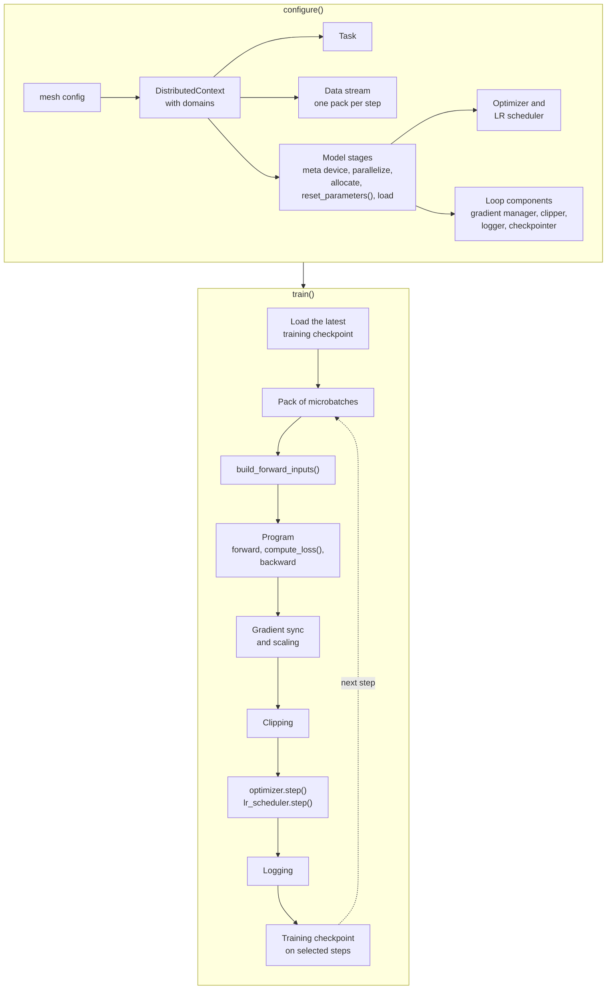

# How d9d Works

## About

This page answers two questions. What does d9d do with the parts that you write? And why does the training loop need no code for your model or your parallelism? The page follows a training job from its parts and the model build, through one step, to its checkpoints and events. Read it after the [Quickstart](../getting_started/quickstart.md) and before you [write your own job](../guides/write_your_own_job.md).

## Overview

`configure()` builds the job once. `train()` resumes from the latest training checkpoint, if one exists, and repeats one step until the end. The sections below follow this picture from top to bottom:



## The Parts of a Job

You write a few parts of a job, each behind an interface. d9d provides ready implementations of the others:

| Interface | What it decides | Who provides it |
|:----------|:----------------|:----------------|
| [Data provider](../loop/interfaces/data.md) | The microbatches of each step. | `AutoDataProvider` with your dataset and collate function, or you. |
| [Model](../models/model_design.md) | The forward pass, from the model inputs to the outputs. | You, or the [Model Catalogue](../models/model_catalogue/index.md). The model provider builds it. |
| [Task](../loop/interfaces/task.md) | The model inputs, the loss and the metrics. | You. |
| [Model provider](../loop/interfaces/model.md) | The construction, distribution, loading and export of the model. | You. |
| [Optimizer](../loop/interfaces/optimizer.md) and [LR scheduler](../loop/interfaces/lr_scheduler.md) providers | The update of the parameters. | `AutoOptimizerProvider` and `AutoLRSchedulerProvider`, or you. |

`TrainingConfigurator` takes these parts and two Pydantic configs:

```python
trainer = TrainingConfigurator(
    mesh=config.mesh,  # Sets the parallelism degrees.
    parameters=config.trainer,  # Sets the steps, checkpointing, logging and other loop settings.
    data_provider=...,
    model_provider=...,
    task_provider=...,
    optimizer_provider=...,
    lr_scheduler_provider=...,
).configure()

trainer.train()
```

`configure()` builds the job and returns a `Trainer`, and `train()` runs the training loop. The `Auto*` providers take Pydantic configs too, so the common cases need no code.

## Device Mesh Domains

The first component that `configure()` builds is the `DistributedContext`. It describes the topology of the job: the ranks (one process per GPU), the device meshes over them and the process groups. The configurator builds it once from the `mesh` config and passes it to every component that needs it. No component reads the device mesh from global state.

Different submodules need different parallelism:

*   **Dense layers**: FSDP shards them across the data-parallel ranks.
*   **MoE experts**: Expert parallelism shards them across the expert-parallel ranks.

The context therefore arranges the same ranks into several device meshes, called **domains**. All domains contain the same ranks, and they differ only in how they group the ranks into named mesh dimensions. The model provider of the Quickstart takes the mesh of the dense domain:

```python
mesh = context.dist_context.mesh_for(DENSE_DOMAIN)
```

[Distributed Context](../core/dist_context.md) lists the domains and their dimensions.

## The Model Build

Pipeline parallelism splits a model into **stages**. Without pipeline parallelism, the whole model is one stage. Each rank builds only the stages that it hosts, and `configure()` builds each of them in this order:

1.  It calls `initialize_model_stage()` of the model provider, which builds the model on the `meta` device, without memory.
2.  It calls `parallelize_model_stage()` to distribute the parameters, unless the job runs without parallelism.
3.  It allocates uninitialized GPU memory for the local shard of each parameter.
4.  It calls `reset_parameters()` of the model to initialize the parameters.
5.  It loads pretrained weights into the stage, if the config names a source.

Distribution comes before allocation. Each rank allocates only its local shard of each parameter, never a full copy first.

This build sets the contract of the model. Every model must implement two methods:

*   **`reset_parameters()`**: Initializes every parameter and buffer after the allocation.
*   **`forward(inputs, shared)`**: Runs the model on one microbatch.

With pipeline parallelism, the model must also:

*   **Build only the layers of its stage**: The model provider reads the stage from `context.stage` and builds the model for it.
*   **Implement `stage_transfer_spec()`**: Describes the tensors that the stage receives from the previous stage and sends to the next one.

See [Model Design](../models/model_design.md) and [Pipeline Parallelism](../models/pipeline_parallelism.md).

## Parameter Placements

A distributed parameter records its own layout. It is a `DTensor`: a PyTorch tensor that carries the local shard of the rank and one **placement** per mesh dimension:

*   **`Shard`**: The ranks along that dimension hold slices of the tensor.
*   **`Replicate`**: Each rank along that dimension holds a full copy.

The `parallelize_*` functions turn the parameters of a submodule into `DTensor`s. In `parallelize_model_stage()`, you call them on submodules, each call with the mesh of a domain. For example, `parallelize_hsdp()` shards a submodule with PyTorch FSDP along one mesh dimension and replicates it along the others.

To add a strategy, write a function that sets the placements you need. [Why the Loop Needs No Model or Parallelism Code](#why-the-loop-needs-no-model-or-parallelism-code) shows what the loop does with them. See [Horizontal Parallelism](../models/horizontal_parallelism.md).

## Steps and Packs

A step is one update of the parameters. The data provider returns a data stream that yields one **pack** per step. A pack contains all microbatches of that step on one rank.

The number of microbatches in a pack is the gradient accumulation factor. `AutoDataProvider` computes it as `global_batch_size` / (`microbatch_size` × the number of data-parallel ranks). A custom data provider can change the number from step to step.

The loop runs `schedule.total_steps` steps. If the config leaves this setting empty, the loop runs as many steps as the data stream reports.

## Pipeline Programs

Gradient accumulation and pipeline parallelism are one mechanism in d9d. A pipeline schedule turns each pack into a **program**: the list of actions that each rank runs. An action is a forward or backward pass of a stage on one microbatch, or a transfer between two stages.

Without pipeline parallelism, a program has no transfers between stages. It contains only the forward and backward passes of the microbatches, which is gradient accumulation. A job with one rank skips the program and runs the forward and backward pass of each microbatch in turn.

With pipeline parallelism, the program also sends the activations of each microbatch to the next stage. The gradients of these activations come back the same way. The schedule sets the order of the actions. This is the program of the 1F1B schedule for two pipeline ranks and a pack of 4 microbatches, mb0 to mb3:

```text
rank 0 (stage 0)                 rank 1 (stage 1)
forward               mb0        receive activations   mb0
send activations      mb0        forward               mb0
forward               mb1        receive activations   mb1
send activations      mb1        backward              mb0
receive gradient      mb0        send gradient         mb0
forward               mb2        receive activations   mb2
send activations      mb2        forward               mb1
backward              mb0        backward              mb1
receive gradient      mb1        send gradient         mb1
forward               mb3        receive activations   mb3
send activations      mb3        forward               mb2
backward              mb1        backward              mb2
receive gradient      mb2        send gradient         mb2
backward              mb2        forward               mb3
receive gradient      mb3        backward              mb3
backward              mb3        send gradient         mb3
```

Each column lists the actions of one rank in order. The rows are not aligned in time, because a pass waits for the data that it needs. Rank 0 starts with several forward passes and then alternates. Rank 1, the last rank, alternates from the start. Other schedules, such as Zero Bubble, produce other programs, and the ranks run them the same way.

See [Pipeline Parallelism](../models/pipeline_parallelism.md) and [Pipelining Internals](../internals/pipelining.md).

## The Loss of a Step

The task turns each microbatch into model inputs, and each model output into a loss. Before the forward passes, the loop calls `build_forward_inputs()` of the task for each microbatch. This method returns three values:

*   **`input`**: The input of the model.
*   **`shared`**: Data that every stage needs, such as the position IDs.
*   **`state`**: What the loss needs besides the model output, such as the targets.

After the last stage, `compute_loss()` receives the model output as `pipeline_results`, together with the `state` of the same microbatch.

The task decides how much each microbatch counts. `compute_loss()` returns the loss and a weight, `loss_weight`, where `None` means a weight of 1. The backward pass starts from the loss multiplied by its weight. Before `optimizer.step()`, the gradient manager divides the gradients by the total weight over all microbatches and ranks. The loss of a step is then the weighted mean of the microbatch losses.

For a per-token loss, `compute_loss()` returns the mean loss of its microbatch and its number of tokens as the weight. The loss of the step is then the mean over all tokens on all ranks, even when microbatches differ in length. See [User Tasks](../loop/interfaces/task.md).

## The Training Loop

The training loop only sets the order of the calls. `TrainingConfigurator` built every object in it and gave each one its collaborators, such as the `DistributedContext` or the model stages. `train()` first loads the latest training checkpoint, if one exists. Then it runs the step loop below. The excerpt leaves out the progress bar, the profiler, tracker bookkeeping, garbage collection, timeout updates and the end-of-data check:

```python
while schedule.current_step < schedule.total_steps:
    event_bus.trigger(EVENT_TRAIN_STEP_PRE, step_ctx)
    device_pack = next(packs)

    with event_bus.bounded(EVENT_TRAIN_FORWARD_BACKWARD_PRE, EVENT_TRAIN_FORWARD_BACKWARD_POST, step_ctx):
        task_operator.forward_backward(device_pack)

    logger.trigger_sync()
    gradient_manager.sync_and_scale()
    grad_norm = gradient_clipper.clip()

    with event_bus.bounded(EVENT_TRAIN_OPTIMIZER_STEP_PRE, EVENT_TRAIN_OPTIMIZER_STEP_POST, step_ctx):
        optimizer.step()

    lr_scheduler.step()
    logger.log(run, loss=gradient_manager.compute_global_loss(), grad_norm=grad_norm)
    gradient_manager.zero_grad()

    event_bus.trigger(EVENT_TRAIN_STEP_POST, step_ctx)
    schedule.step()
    checkpointer.checkpoint_if_needed(state)
```

Five components do the work of a step:

*   **`task_operator`**: Runs the forward and backward passes of the pack and calls the task for each microbatch.
*   **`gradient_manager`**: Waits for the gradient sync, which sums the gradients across ranks and overlaps with the last backward passes. Then it divides the gradients by the total loss weight. Its `zero_grad()` clears them for the next step.
*   **`gradient_clipper`**: Computes the global gradient norm after the gradient sync. It clips the gradients if `gradient_clipping.max_norm` is set.
*   **`logger`**: Writes the loss and the gradient norm to the tracker. On logging steps, it also syncs the metrics across ranks and writes them.
*   **`checkpointer`**: Saves a training checkpoint at the steps that the `checkpointing` config selects.

The `event_bus` calls mark the points where your code can hook in (see [Events](#events)). [Training Loop](../loop/train.md) describes the full lifecycle, from configuration to finalization.

## Why the Loop Needs No Model or Parallelism Code

Each distributed parameter records its placements. The loop components read these placements instead of asking the model. A new model or a new strategy therefore needs no change in the loop:

*   **Gradient sync**: The gradient manager sums each gradient over the mesh dimensions where its parameter is replicated. FSDP sums the gradients over its shard dimension itself.
*   **Gradient clipping**: The clipper sums the squared norms of sharded gradients over the dimensions they are sharded along. A replicated gradient is the same on every rank and counts once. With pipeline parallelism, the clipper also sums over the pipeline ranks.
*   **Training checkpoints**: Every rank writes its own shards. A replicated tensor is written once.
*   **Loading pretrained weights**: The job shards each loaded tensor to match the placements of its parameter.

See [Gradient Norm and Clipping](../internals/grad_norm.md).

## Training Checkpoints and Model States

d9d uses two kinds of files. A training checkpoint resumes a job. A model state exchanges weights with other tools.

A **training checkpoint** is a PyTorch Distributed Checkpoint. It contains the model stages, the optimizer, the LR scheduler and the step counter. It also contains the position in the data stream, the metrics, the state of the experiment tracker and the `state_dict()` of the task. See [Checkpointing](../loop/checkpointing.md).

A **model state** contains only weights, as `.safetensors` files. At the start, the job loads the model state that `trainer.model_stage_factory.source_checkpoint` points to. The setting names a model state, not a training checkpoint. `Trainer.export()` writes a model state.

The layout of a model state often differs from the layout of your model. For example, a Hugging Face model can store the query, key and value projections as three tensors, while your model keeps them in one. A graph of **state mappers** translates between the layouts:

```python
mapper = ModelStateMapperParallel([
    # Concatenates three tensors of the model state into one parameter of the model.
    ModelStateMapperConcatenateTensors(
        source_names=[
            "model.layers.0.self_attn.q_proj.weight",
            "model.layers.0.self_attn.k_proj.weight",
            "model.layers.0.self_attn.v_proj.weight",
        ],
        target_name="layers.0.attn.qkv.weight",
        dim=0,
    ),
    # Keeps the value of one tensor under a new name.
    ModelStateMapperRename(name_from="model.layers.0.self_attn.o_proj.weight", name_to="layers.0.attn.out.weight"),
])
```

Each mapper declares groups: sets of input tensors and the output tensors that they produce. The **reader** streams a model state through a mapper, one file at a time. It reads only the tensors that the mapper needs and frees them once their group is done. Memory holds the needed tensors of the current file, plus the inputs of groups that still wait for tensors in later files.

The model provider returns the loading mapper from `initialize_model_stage()`. It returns the export mapper from `prepare_export_model_stage()`. A PEFT method, such as LoRA, returns a mapper for the layers that it changes. See [Model State Mapper](../model_states/mapper.md) and [Model State I/O](../model_states/io.md).

## Events

Events let you add behavior to the loop from your own classes, without subclassing `Trainer`. The loop triggers typed events at fixed points: during configuration, around each step, around the forward and backward passes and around `optimizer.step()`. The task and the model provider subscribe to events in `register_events()`.

Colocated RL, for example, hands the GPUs to a rollout engine after each step. The task gets the trainer once `configure()` returns it:

```python
class RLTask(TrainTask):
    # build_forward_inputs() and compute_loss() are as in any task.
    trainer: Trainer

    def register_events(self, context: RegisterTaskEventsContext) -> None:
        subscribe_annotated(context.event_bus, self)

    @subscribe(EVENT_TRAIN_STEP_POST)
    def _generate_rollouts(self, ctx: EventStepContext) -> None:
        self.trainer.sleep()  # Frees the GPU memory of the parameters, gradients and optimizer state.
        ...  # Runs the rollout engine on the freed GPUs.
        self.trainer.wake()  # Restores them on the GPUs.


task = RLTask()
trainer = TrainingConfigurator(..., task_provider=lambda ctx: task).configure()
task.trainer = trainer
```

See [Event Bus and Hooks](../loop/interfaces/events.md) and [Sleep and Wake](../loop/train.md#sleep-and-wake-colocated-rl).

## Where to Go Next

To build a job of your own, continue with [Write Your Own Job](../guides/write_your_own_job.md). For forward-only runs over a dataset, see [Inference Loop](../loop/inference.md).
