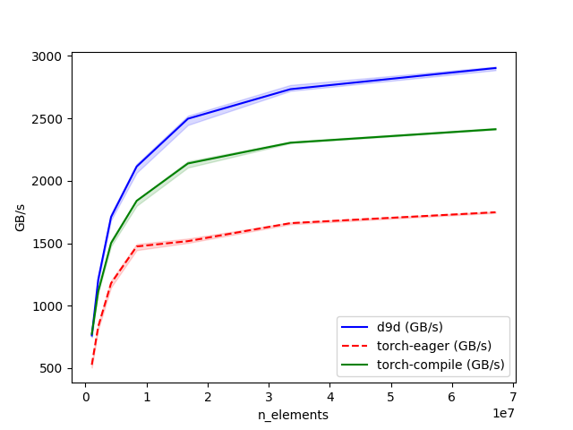

# Feed Forward Networks (FFN)

## About

The `d9d.module.block.ffn` package implements standard dense Feed-Forward networks used in Transformer blocks.

## Features

### SwiGLU

`SwiGLU` is a [SwiGLU layer](https://arxiv.org/pdf/2002.05202).

Uses efficient SiLU-Mul kernel.

#### Kernel Benchmarks (BF16, H100)

### GeluMLP

`GeluMLP` is a standard two-layer MLP with tanh-approximated GELU activation, as used in Vision
Transformer blocks.

::: d9d.module.block.ffn
