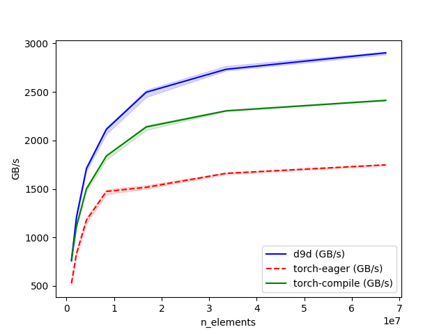

# Mixture of Experts (MoE)

## About

The `d9d.module.block.moe` package provides a complete, high-performance implementation of Sparse Mixture-of-Experts layers.

## Expert Parallelism

For information on setting up Expert Parallelism, see [this page](../models/horizontal_parallelism.md).

## Features

### Sparse Expert Router

`TopKRouter` is a learnable router implementation.

It computes routing probabilities in FP32 to ensure numeric stability.

### Sparse Expert Token Dispatcher

`ExpertCommunicationHandler` is the messaging layer.

`NoCommunicationHandler` is used by default for single-GPU or Tensor Parallel setups where no token movement is needed.

`DeepEpCommunicationHandler` is enabled if using Expert Parallelism. It uses the [DeepEP](https://github.com/deepseek-ai/DeepEP) library for highly optimized all-to-all communication over NVLink/RDMA, enabling scaling to thousands of experts.

### Sparse Experts

`GroupedSwiGLU` provides a sparse SwiGLU experts module implementation.

Instead of looping over experts, it uses [Grouped GEMM](https://github.com/fanshiqing/grouped_gemm/) kernels to execute all experts in parallel, regardless of how many tokens each expert received.

Uses efficient fused SiLU-Mul kernel.

#### Kernel Benchmarks (BF16, H100)



### Shared Experts

A shared expert processes all tokens passing through the MoE layer regardless of the router's sparse choices, providing a dense computational backbone. It is configured using `SharedExpertParameters` and includes an optionally enabled linear gating mechanism to dynamically scale the shared expert's output.

### Expert Replay

When post-training an MoE policy with reinforcement learning, the rollout engine (e.g. vLLM, SGLang) and the trainer route the same token to *different* experts because their routing kernels differ numerically. The resulting train/inference mismatch corrupts the importance ratio and destabilizes training. **Expert Replay** (an implementation of [Rollout Routing Replay](https://arxiv.org/abs/2510.11370)) removes the mismatch: the expert selection produced during rollout is recorded and *replayed* in the training forward pass, while the gating weights are still recomputed from the training router's logits so the gate keeps learning.

The selection is passed to the model as the optional `replay_indices` input — a mapping from each MoE layer's module name (e.g. `"layers.5.mlp"`) to a `(batch, seq_len, top_k)` tensor of expert ids. Keying by name (rather than packing every layer into one positional tensor) keeps the interface robust to non-sequential layer topologies, and each per-layer tensor is micro-batched by the pipeline independently. When omitted, routing behaves exactly as in standard training. Supply it from your `TrainTask.build_forward_inputs` (alongside `position_ids`) using the per-layer expert ids reported by your rollout engine:

```python
return BuildForwardInputsResult(
    inputs={"input_ids": batch.input_ids},
    kwargs={"position_ids": batch.position_ids, "replay_indices": batch.rollout_expert_indices},
)
```

When d9d itself samples the rollout, `RouterReplayRecorder` captures the selection of every MoE layer during a forward pass and assembles it into the `replay_indices` mapping.

```python
from d9d.module.block.moe import RouterReplayRecorder

backbone = model.model
with RouterReplayRecorder().install(backbone) as recorder, torch.no_grad():
    model(input_ids=ids, position_ids=pos)
    tape = recorder.tape()  # {"layers.0.mlp": ..., "layers.1.mlp": ..., ...}

# replay the recorded routing in the subsequent training forward
model(input_ids=ids, position_ids=pos, labels=labels, replay_indices=tape)
```

::: d9d.module.block.moe

::: d9d.module.block.moe.communications
