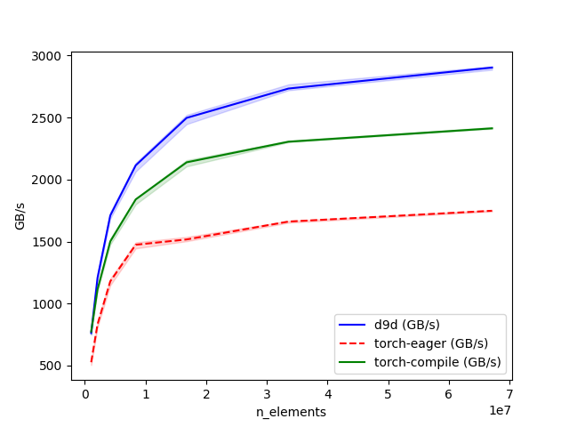

# Mixture of Experts (MoE)

## About

The `d9d.module.block.moe` package implements sparse Mixture-of-Experts layers. `MoELayer` combines a router, a token dispatcher and the experts, with an optional shared expert. The layer requires the `d9d[moe]` extra. You must build and install [grouped-gemm](https://github.com/fanshiqing/grouped_gemm/) manually first. Expert parallelism also needs [DeepEP](https://github.com/deepseek-ai/DeepEP), which you must build and install the same way.

## Expert Parallelism

To set up expert parallelism, see [Horizontal Parallelism](../horizontal_parallelism.md).

## Components

### Router

`TopKRouter` is a learned router that selects the top-k experts for each token. It computes the routing probabilities in fp32 for numerical stability. An optional expert bias changes which experts are selected but not their probabilities. You can use it for loss-free load balancing.

### Token Dispatcher

`ExpertCommunicationHandler` is the interface that moves tokens to their experts and back.

*   `NoCommunicationHandler` is the default. It is used when all experts are local, such as on a single GPU or with tensor parallelism.
*   With expert parallelism, `parallelize_expert_parallel` switches the layer to a DeepEP handler. It runs the all-to-all communication over NVLink and RDMA with [DeepEP](https://github.com/deepseek-ai/DeepEP).

### Experts

`GroupedSwiGLU` holds a set of SwiGLU experts. It does not loop over experts. It runs all experts in one [grouped GEMM](https://github.com/fanshiqing/grouped_gemm/) per projection, for any number of tokens per expert. It computes `SiLU(gate(x)) * up(x)` with a fused Triton kernel.

#### Kernel Benchmarks (bf16, H100)



### Shared Experts

A shared expert processes every token, whatever the router chooses. Configure it with `SharedExpertParameters`. It can scale its output with a learned sigmoid gate (`enable_gate`).

## Usage

```python
import torch

from d9d.module.block.moe import MoELayer, SharedExpertParameters

moe = MoELayer(
    hidden_dim=2048,
    intermediate_dim_grouped=768,
    num_grouped_experts=128,
    top_k=8,
    router_renormalize_probabilities=True,
    shared_expert=SharedExpertParameters(intermediate_size=4096, enable_gate=True),
).to(device="cuda", dtype=torch.bfloat16)
moe.reset_parameters()

hidden_states = torch.randn(2, 16, 2048, device="cuda", dtype=torch.bfloat16)
output = moe(hidden_states)  # (2, 16, 2048)

# Number of tokens routed to each expert since the last reset.
print(moe.tokens_per_expert)
moe.reset_stats()
```

## API Reference

::: d9d.module.block.moe

::: d9d.module.block.moe.communications
