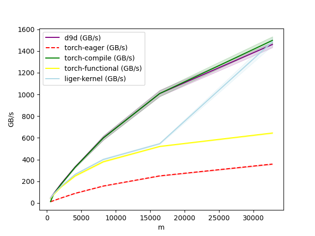
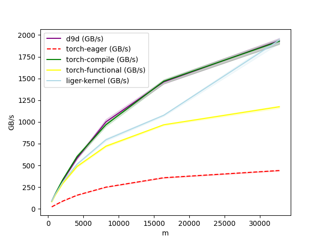
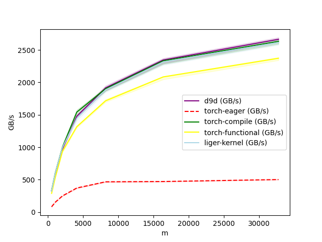
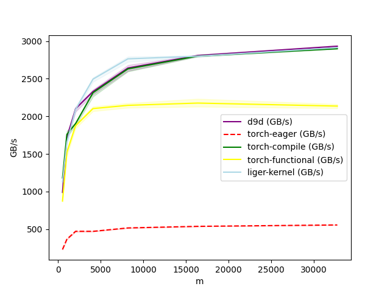
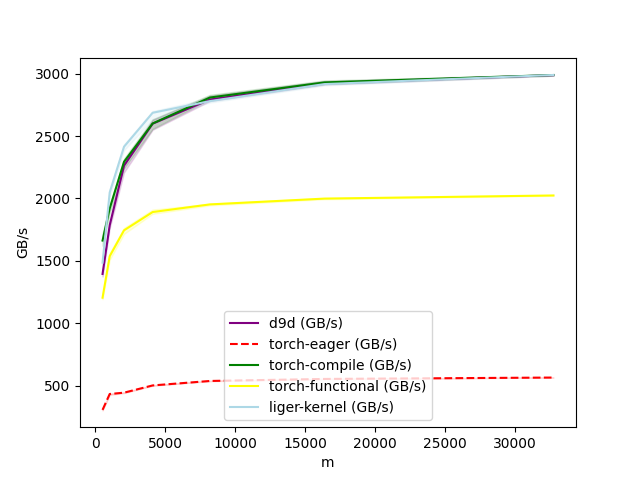
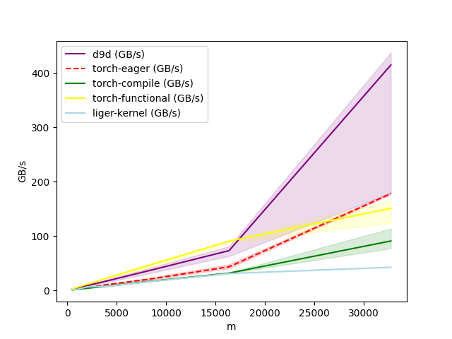
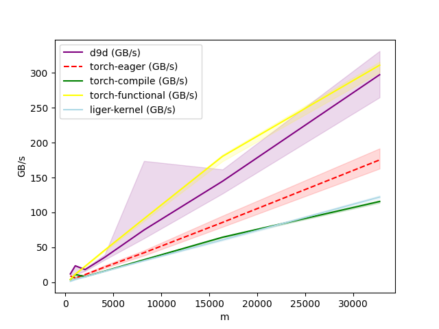
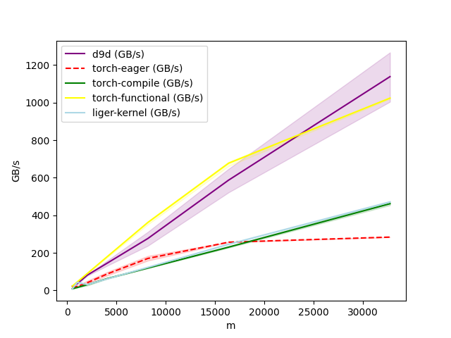
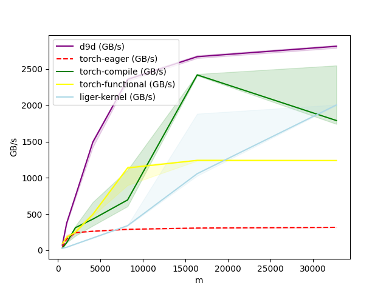
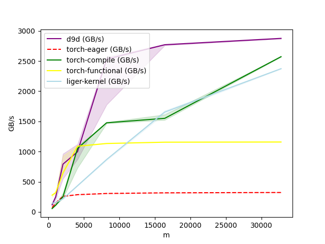

# Normalization Layers

## About

The `d9d.module.block.normalization` module implements memory-efficient normalization layers.

## Features

### RMSNorm

`RMSNorm` implements [Root Mean Square Layer Normalization](https://arxiv.org/abs/1910.07467).

Uses an efficient custom Triton kernel for forward and backward passes.

It includes native support for zero-centered scaling weights.

#### Kernel Benchmarks (BF16, H100)

**Forward, Hidden Size = 128**

**Forward, Hidden Size = 256**

**Forward, Hidden Size = 1024**

**Forward, Hidden Size = 4096**

**Forward, Hidden Size = 7168**

**Backward, Hidden Size = 128**

**Backward, Hidden Size = 256**

**Backward, Hidden Size = 1024**

**Backward, Hidden Size = 4096**

**Backward, Hidden Size = 7168**

::: d9d.module.block.normalization
