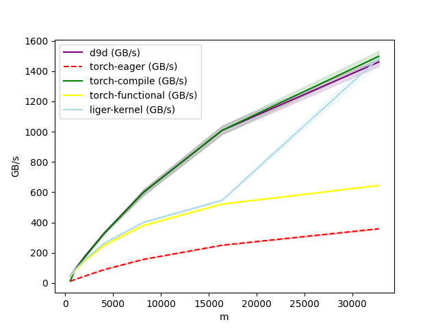
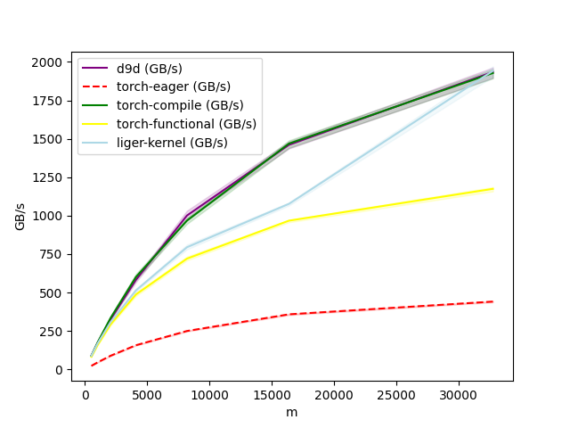
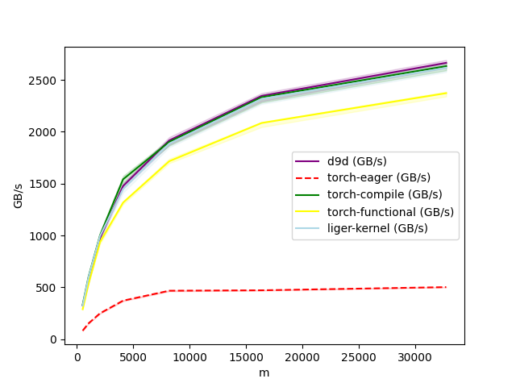
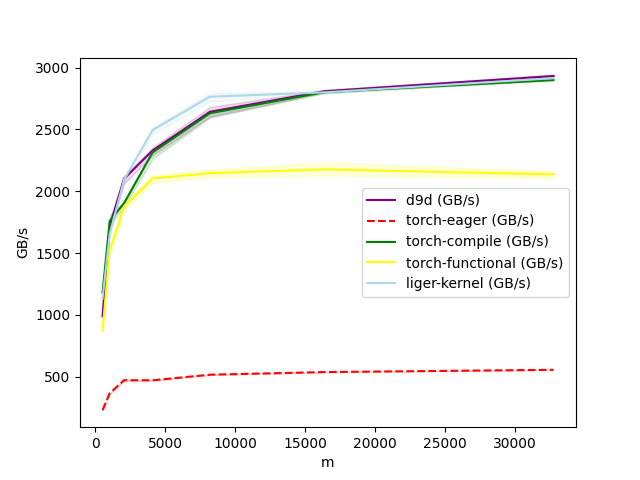
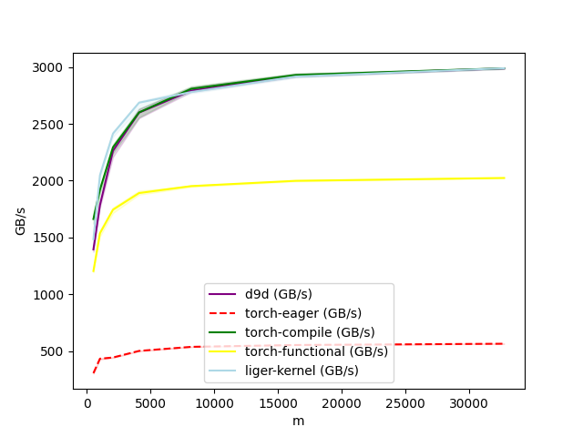
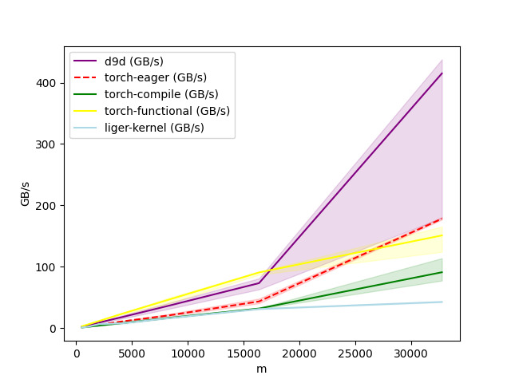
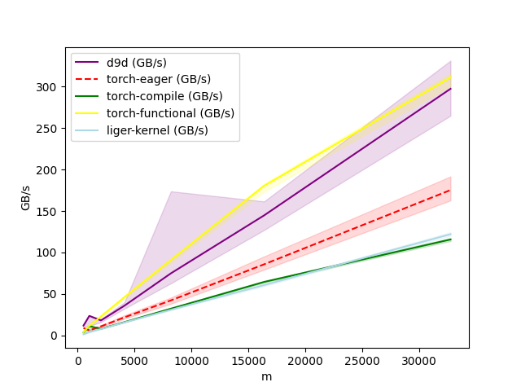
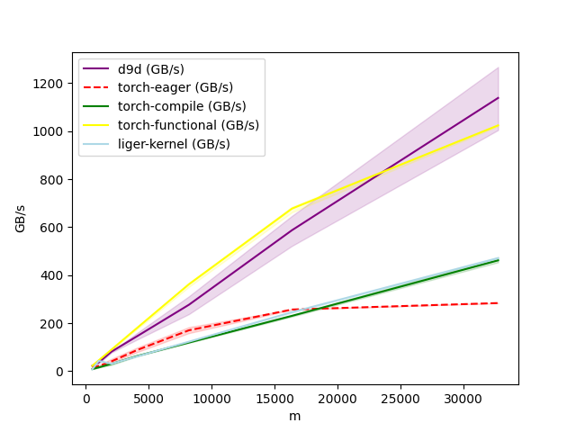
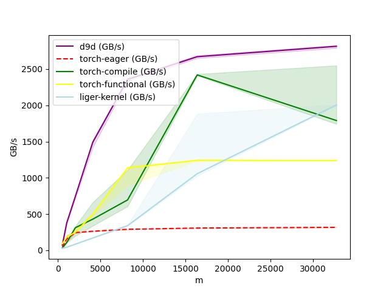
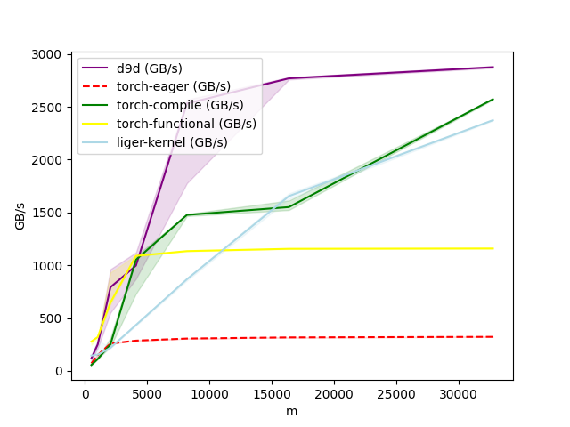

# Normalization Layers

## About

The `d9d.module.block.normalization` package implements normalization layers.

## RMSNorm

`RMSNorm` implements [Root Mean Square Layer Normalization](https://arxiv.org/abs/1910.07467).

It uses a custom Triton kernel for the forward and backward passes, so it requires a GPU supported by Triton.

It supports zero-centered scaling weights (`zero_centered=True`). They are initialized to 0, and the kernel scales by `weight + 1`.

### Kernel Benchmarks (bf16, H100)

**Forward, Hidden Size = 128**



**Forward, Hidden Size = 256**



**Forward, Hidden Size = 1024**



**Forward, Hidden Size = 4096**



**Forward, Hidden Size = 7168**



**Backward, Hidden Size = 128**



**Backward, Hidden Size = 256**



**Backward, Hidden Size = 1024**



**Backward, Hidden Size = 4096**



**Backward, Hidden Size = 7168**



## Usage

```python
import torch

from d9d.module.block.normalization import RMSNorm

norm = RMSNorm(hidden_size=2048, eps=1e-6).cuda()
norm.reset_parameters()

hidden_states = torch.randn(2, 16, 2048, device="cuda")
output = norm(hidden_states)  # (2, 16, 2048)
```

## API Reference

::: d9d.module.block.normalization
