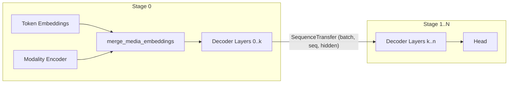

# Multimodality

## The d9d Approach

A multimodal model in d9d is the explicit composition of three parts: a **modality encoder** (e.g.
a vision tower), the **merge** of media embeddings into the token sequence, and the regular
**language backbone**. There is no generic "multimodal model" base class — each model package
assembles the pieces explicitly, following the [model design](./model_design.md) principles.

Everything modality-specific happens strictly on the **first pipeline stage**. After the merge,
the payload crossing stage boundaries is the ordinary `SequenceTransfer` — pipelining schedules
and parallelization plans are unaffected.

## Media IO

Media flows into the first stage as part of the model's `PipelineInput`:

* `MediaSegments` (`d9d.module.base`) — a packed stream of variable-length media segments:
  `features` of shape `(total_patches, feature_dim)` plus per-segment `grid_thw` of shape
  `(num_segments, 3)`. An image is a segment with `t == 1`; a video is a segment with `t > 1`.
* `MultimodalSequenceInput` (`d9d.module.model.io`) — token ids, the media stream, and a boolean
  `media_token_mask` marking the placeholder positions in the token sequence.

Segments appear in `grid_thw` in the same order as their placeholder runs occur in the row-major
flattened token sequence. The collator guarantees this ordering.

A modality encoder is any module satisfying the `ModalityEncoder` protocol: it consumes
`MediaSegments` and returns `(total_media_tokens, hidden_size)` embeddings. The merge is performed
by `merge_media_embeddings` (`d9d.module.block.embedding`), which validates that the placeholder
count matches the media token count and scatters the embeddings in.

## Multimodal Positions (MRoPE)

Multimodal models use 3D position ids — separate position planes for the temporal, height and
width axes, shape `(3, batch, seq)` — carried in the ordinary `SequenceShared.position_ids` field.

* `MultimodalRotaryEmbeddingProvider` (`d9d.module.block.positional`) combines per-plane rotary
  embeddings according to `mrope_section`. For text tokens (identical positions in all three
  planes) the output is numerically identical to the standard `RotaryEmbeddingProvider`.
* `compute_multimodal_position_ids` (`d9d.dataset`) computes the 3D indices on CPU in the
  collator. Following the d9d convention (like label shifting), index arithmetic is dataset-side
  work — stages never recompute positions.

## Data Conventions

1. Media features of all samples of a microbatch are concatenated into one `MediaSegments`, in
   row-major placeholder order.
2. `media_token_mask` marks placeholder positions; its `True`-count must equal the encoder's
   output token count (for vision: the sum of `grid_thw` products divided by
   `spatial_merge_size**2`).
3. `position_ids` of shape `(3, batch, seq)` are computed via `compute_multimodal_position_ids`.

### The Empty-Media Convention

The modality encoder runs on **every** microbatch. Two constraints force this:

* All microbatches of a pack must share the same `PipelineInput` PyTree structure, so `media`
  cannot be `None` in some microbatches only.
* FSDP all-gathers are lazily triggered by module forward. If the encoder is skipped on one rank
  of a shard group while another rank runs it, the collective deadlocks.

Text-only microbatches therefore carry one minimal dummy segment, built by `pad_empty_media`
(`d9d.dataset`). Its output is attached by `merge_media_embeddings` with a zero-valued
contribution (the media token mask is all-`False`); it adds zero gradient signal but keeps every
collective and the autograd graph structurally identical across ranks and microbatches.

## Pipeline Load Balancing

The encoder's cost on the first stage is accounted for with the existing
`pipeline_num_virtual_layers_pre` mechanism (see
[Pipeline Parallelism](./pipeline_parallelism.md)).
