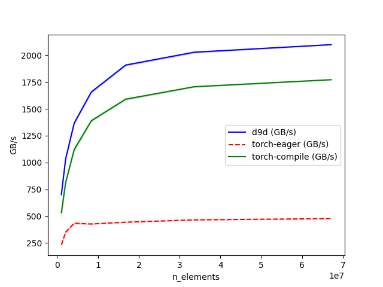

# Stochastic Optimizers

## What is Stochastic Rounding and Why is It Useful For Optimization

Standard floating-point casting (e.g., `tensor.to(torch.bfloat16)`) typically utilizes **Round-to-Nearest-Even**. This method is statistically biased.

When training models in reduced precision (like BF16), standard "Round to Nearest" operations can lead to stalling. If a weight update is smaller than the smallest representable difference for a given float value, the update disappears completely.

Stochastic Rounding replaces rigid rounding with a probabilistic approach: for instance, if a value $x$ is $30\%$ of the way between representable numbers $A$ and $B$, it has a $30\%$ chance of rounding to $B$ and $70\%$ chance of rounding to $A$. Over multiple updates, the statistical expectation matches the true high-precision value $E[Round(x)] = x$, allowing training to converge even when individual updates are technically "too small" for the format.

For more information, please refer to:

* [Zamirai, Pedram, et al. “Revisiting BFloat16 Training.” Version 2](https://arxiv.org/abs/2010.06192v2)
* [Ozkara, Kaan, et al. “Stochastic Rounding for LLM Training: Theory and Practice.”](https://arxiv.org/abs/2502.20566)

## About

This module provides optimizers for low precision training with stochastic rounding using highly optimized **Triton** kernels.

## Benchmarks

All the benchmarks were performed on a single NVDIA H100 80GB GPU.

### copy_fp32_to_bf16_stochastic_

### adamw_stochastic_bf16_

::: d9d.optim.stochastic
    options:
        show_root_heading: true
        show_root_full_path: true

::: d9d.kernel.stochastic
    options:
        show_root_heading: true
        show_root_full_path: true
