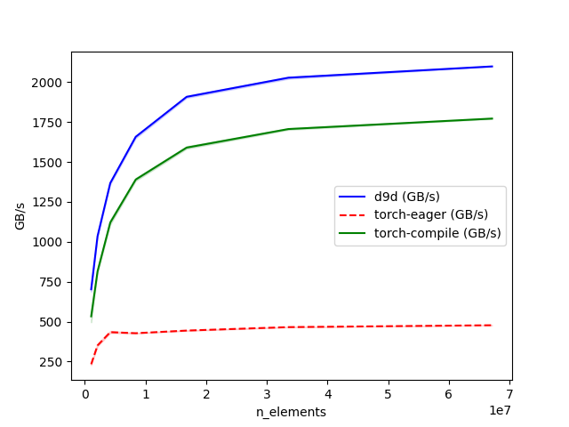
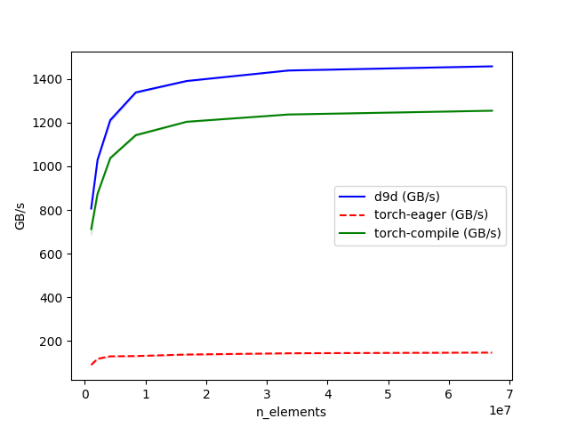

# Stochastic Optimizers

## About

The `d9d.optim.stochastic` module provides optimizers for training with bf16 parameters and no fp32 master copy. They round the updated parameters to bf16 with stochastic rounding. The update and the rounding run in one fused **Triton** kernel. The kernels live in `d9d.kernel.stochastic` and can also be called directly.

## Stochastic Rounding

A standard cast such as `tensor.to(torch.bfloat16)` rounds to the nearest representable value. In bf16 training this can stall learning. If an update is smaller than half the gap between two bf16 values, rounding removes it completely.

Stochastic rounding rounds up or down at random. For example, if a value $x$ is $30\%$ of the way from representable value $A$ to representable value $B$, it rounds to $B$ with $30\%$ probability and to $A$ with $70\%$ probability. The expected result equals the exact value, $E[Round(x)] = x$. Small updates therefore add up over many steps instead of being lost.

For details, see:

*   [Zamirai, Pedram, et al. “Revisiting BFloat16 Training.” Version 2](https://arxiv.org/abs/2010.06192v2)
*   [Ozkara, Kaan, et al. “Stochastic Rounding for LLM Training: Theory and Practice.”](https://arxiv.org/abs/2502.20566)

## Limits

*   The kernels need a GPU that runs Triton.
*   `StochasticAdamW` parameters must be bf16. Gradients can be bf16 or fp32. Optimizer states can be fp32 or bf16 (`state_dtype`).
*   `StochasticAdamW` does not support closures or sparse gradients.

## Usage

```python
import torch

from d9d.optim.stochastic import StochasticAdamW

model: torch.nn.Module = ...
model = model.to(torch.bfloat16)

optimizer = StochasticAdamW(
    model.parameters(),
    lr=1e-4,
    weight_decay=0.01,
    state_dtype=torch.bfloat16,
)
```

`StochasticAdamW` saves the state of its random number generator in `state_dict()`. A resumed run gets the same rounding noise.

## Benchmarks

The plots show throughput in GB/s against the number of elements. The baselines are a PyTorch eager and a `torch.compile` implementation of the same operation.

### `copy_fp32_to_bf16_stochastic_` (H100 80GB, fp32 source, bf16 target)



### `adamw_stochastic_bf16_` (H100 80GB, bf16 parameters, gradients and states)



## API Reference

::: d9d.optim.stochastic

::: d9d.kernel.stochastic
